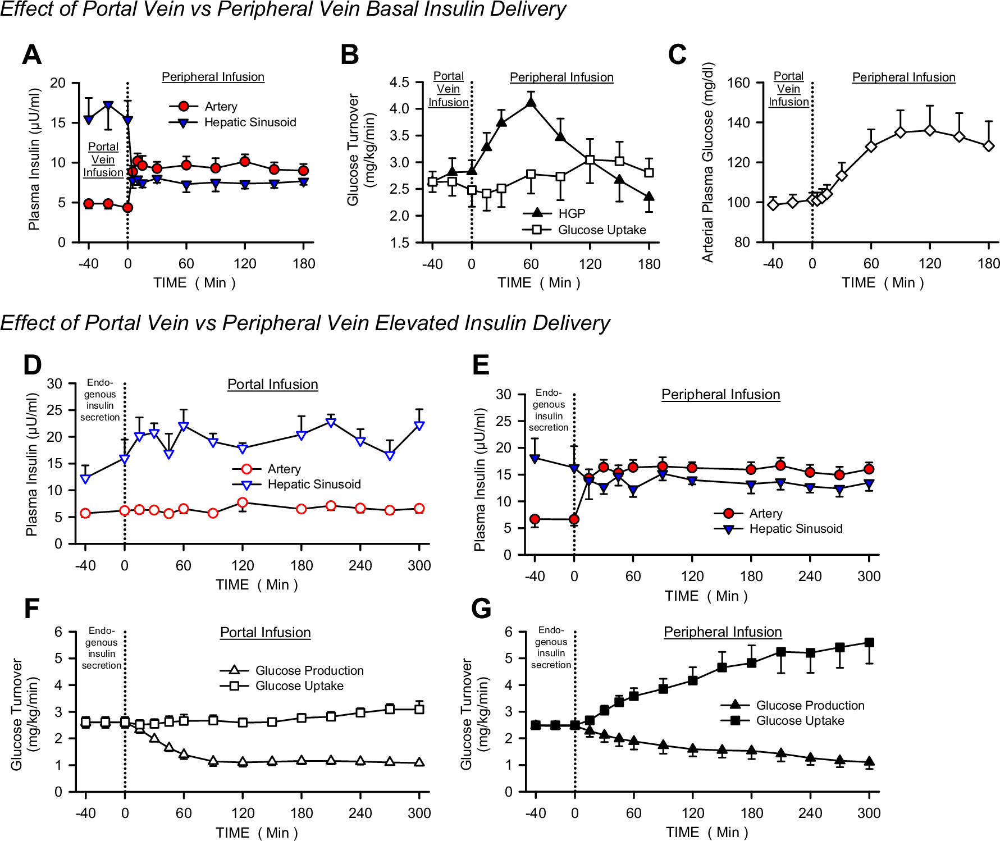
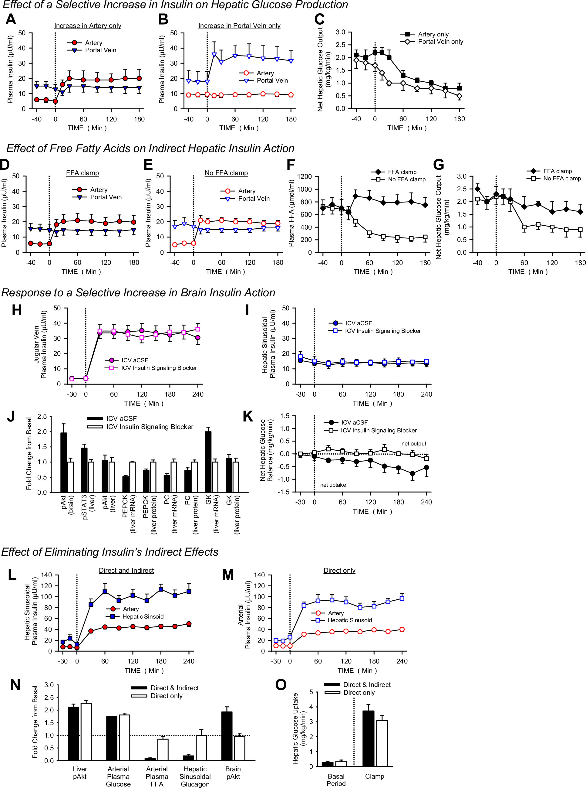
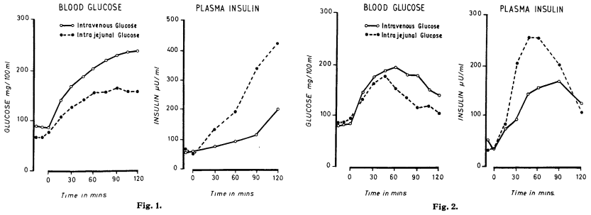

直接点击链接即可跳转到论文。如果无法打开链接，或者链接打开后发现无法查看论文，可以在`./papers`里找到部分论文

论文或网站中一些可能有用的图片直接贴在这个md里了

> 这是论文摘要或者gpt生成的论文大意

---

# Intro 马克思减肥神药

- 马斯克减肥神药 [Wegovy](https://www.wegovy.com/)

- [司美格鲁肽](https://en.wikipedia.org/wiki/Semaglutide)

- [司美格鲁肽注射液新适应症申报上市，GLP-1类药物搅动减肥市场](https://www.21jingji.com/article/20230605/herald/1964eee518eafbecab6d5f150c2753bc.html)

# FDA审批

- [Ozempic FDA Approval History](https://www.drugs.com/history/ozempic.html)

- 司美格鲁肽临床减肥效果喜人

  论文： [Once-Weekly Semaglutide in Adolescents with Obesity](https://www.nejm.org/doi/10.1056/NEJMoa2208601?url_ver=Z39.88-2003&rfr_id=ori:rid:crossref.org&rfr_dat=cr_pub%20%200pubmed)

  在完成 20 周磨合期的超重或肥胖成人中，与改用安慰剂相比，维持皮下注射索马鲁肽治疗可导致体重持续减轻 

- 论文：[Effect of Continued Weekly Subcutaneous Semaglutide vs Placebo on Weight Loss Maintenance in Adults With Overweight or Obesity](https://jamanetwork.com/journals/jama/fullarticle/2777886)

	> see Figure.ppt Figure(1).ppt

# 糖尿病和胰岛素的原理及历史

- textbook [糖尿病原理](https://link.springer.com/book/10.1007/978-0-387-09841-8) 但是应该没必要看，从别的地方也可以大概了解到

- 胰岛素原理和历史的综述 [Voices: Insulin and beyond](https://www.cell.com/cell-metabolism/fulltext/S1550-4131(21)00124-8?_returnURL=https%3A%2F%2Flinkinghub.elsevier.com%2Fretrieve%2Fpii%2FS1550413121001248%3Fshowall%3Dtrue)

- 胰岛素递送途径对其控制葡萄糖代谢的重要性 [Importance of the route of insulin delivery to its control of glucose metabolism](https://journals.physiology.org/doi/full/10.1152/ajpendo.00628.2020?rfr_dat=cr_pub++0pubmed&url_ver=Z39.88-2003&rfr_id=ori%3Arid%3Acrossref.org)

  > 这篇论文探讨了胰腺分泌的胰岛素如何在肝脏与身体其他部位之间产生一个大约3:1的胰岛素梯度，并强调了这个梯度在空腹和进食期间对正常葡萄糖代谢控制的重要性。论文指出，<u>**当胰岛素通过皮下注射给药时，这种生理分布会丧失，导致肝脏葡萄糖产生的调节受损、全身葡萄糖摄取减少以及动脉高胰岛素血症**</u>。胰岛素可以通过多种机制调节肝脏葡萄糖的产生和摄取，但在生理条件下，其对肝脏的直接效应是主导的。鉴于与医源性高胰岛素血症相关的并发症，设计能够优先作用于肝脏的胰岛素可能具有治疗优势。

  

  

  

# 认知的局限

- [A Gastric Inhibitory Polypeptide II: The Complete Amino Acid Sequence](https://sci-hub.ru/https://cdnsciencepub.com/doi/10.1139/o71-122)

  > 这篇论文报道了猪胃抑制多肽（**GIP**）的完整氨基酸序列。猪胃抑制多肽是一种含有43个氨基酸残基的多肽，其氨基酸序列为Tyr-Ala-Glu-Gly-Thr-Phe-11e-Ser-Asp-Tyr-Ser-1le-Ala-Met-Asp-Lys-Ii+Arg-Gln-GlnAsp-Phe-Val-Asn-Trp-Leu-Leu-Ala-Gln-GIn-Lys-Gly-Lys-Lys-Ser-Asp-Trp-Lys-His-Asn-I1+ Thr-Gln。论文还指出，前26个氨基酸中有15个与猪胰高血糖素中的相同位置的氨基酸相同，前26个中有9个与猪分泌素中的相同位置的氨基酸相同。此外，论文计算了该多肽的分子量为5105。

- [Sir Harold Himsworth and Insulin insensitivity 75 years on](https://onlinelibrary.wiley.com/doi/10.1111/j.1464-5491.2011.03488.x)

  > 这篇论文主要回顾了**胰岛素抵抗这一生物学缺陷在2型糖尿病发病机制中的重要性**，并纪念了Sir Harold Himsworth在胰岛素研究领域的贡献。文章讨论了胰岛素抵抗的现代分类和治疗，以及与心血管疾病风险因素的关系。此外，论文还探讨了胰岛素抵抗在其他疾病如多囊卵巢综合征、睡眠障碍和病理性脑衰老中的作用，并介绍了通过研究罕见突变的分子遗传学来理解严重胰岛素抵抗的机制。最后，文章强调了Himsworth的临床实验方法的简单优雅，并指出他的工作预示了当前关于胰岛素生理学的概念。

- [Glucose clamp technique: a method for quantifying insulin secretion and resistance](https://journals.physiology.org/doi/abs/10.1152/ajpendo.1979.237.3.E214?rfr_dat=cr_pub++0pubmed&url_ver=Z39.88-2003&rfr_id=ori%3Arid%3Acrossref.org)

  > 这篇论文介绍了两种用于量化胰岛素分泌和抵抗的方法，即高血糖夹持技术（hyperglycemic clamp technique）和等血糖胰岛素夹持技术（euglycemic insulin clamp technique）。高血糖夹持技术通过急性提高血浆葡萄糖浓度并维持在一个高于基础水平的状态来评估β细胞对葡萄糖的敏感性。等血糖胰岛素夹持技术则是通过急性提高并维持血浆胰岛素浓度在大约100 mU/ml的水平来评估组织对外源性胰岛素的敏感性。这两种方法都利用负反馈原理来调整葡萄糖或胰岛素的输注速率，以保持目标的血糖或胰岛素水平。

- 口服葡萄糖耐量试验期间葡萄糖反应曲线的形状预示着肥胖青年 2 型糖尿病风险的生物标志物

  [The Shape of the Glucose Response Curve During an Oral Glucose Tolerance Test Heralds Biomarkers of Type 2 Diabetes Risk in Obese Youth](https://diabetesjournals.org/care/article/39/8/1431/37102/The-Shape-of-the-Glucose-Response-Curve-During-an)

  > 在没有糖尿病的肥胖青年中，与双相葡萄糖曲线相比，单相葡萄糖曲线所赋予的风险与空腹和 2 小时葡萄糖和胰岛素浓度无关，反映在**<u>较低的胰岛素敏感性和较差的β细胞功能</u>**，这是青年 **2 型糖尿病**的两个主要病理生理生物标志物。

- 肠促胰岛素概念的起源和理解

  [The Origin and Understanding of the Incretin Concept](https://www.frontiersin.org/journals/endocrinology/articles/10.3389/fendo.2018.00387/full)

  > 在生理浓度下刺激胰岛素分泌的胃肠道激素是肠促胰岛素。随着肠道激素GLP-1（胰高血糖素样肽-1）用于糖尿病治疗的药物开发出来，这一概念最近引起了相当大的关注。但重新燃起的热情也将这一概念限制在两种激素上，即GLP-1和GIP（葡萄糖依赖性促胰岛素多肽）。本概述的目的有两个：首先要说明肠促胰岛素的概念远非新概念。它有一个多世纪的历史，充满了跌宕起伏。其次，肠促胰岛素的概念现在可能变得过于狭隘。因此，肠促胰岛素很可能含有额外的胃肠道激素，这些激素在含有蛋白质、脂肪和复合碳水化合物（而不仅仅是纯葡萄糖）的正常膳食中与 GIP 和 GLP-1 相互作用。这种更广泛的肠促胰岛素概念可能会刺激新型肠道激素衍生药物的开发。

- 胃抑制性多肽刺激人胰岛素分泌

  [Stimulation of insulin secretion by gastric inhibitory polypeptide in man](https://academic.oup.com/jcem/article-abstract/37/5/826/2686318?redirectedFrom=fulltext&login=false#no-access-message)

  > 这篇论文研究了胃抑制多肽（GIP）对胰岛素分泌的影响。在实验中，研究人员通过静脉注射生理剂量的GIP和葡萄糖给正常志愿者，并观察其对血液中胰岛素反应指数（IRI）上升的增强作用以及对葡萄糖耐量的影响。此外，论文还探讨了从猪十二指肠空肠粘膜提取物中得到的不同制剂，包括秘林和胰高血糖素-胆囊收缩激素（PZ-CCK），它们是否也能增强人体对高血糖状态下胰岛素水平的响应。
  >
  > 论文的结论是**<u>GIP是一种强效的胰岛素促进激素，并且很可能在肠道吸收营养物质期间的高血糖状态下参与生理上增强胰岛素分泌的过程</u>**。这一发现有助于我们更好地理解胰岛素分泌调节机制，并可能为糖尿病治疗提供新的策略。

- 口服葡萄糖耐量的新解释 1964年

  [NEW INTERPRETATION OF ORAL GLUCOSE TOLERANCE](https://www.thelancet.com/journals/lancet/article/PIIS0140-6736(64)90011-X/fulltext) 这个论文没法免费获取or在线阅读，直接在`paper`里看

  > 长期以来，人们认为血糖水平的升高是刺激胰腺分泌胰岛素的主要因素。然而，最近有怀疑血糖水平升高是否单独作为胰岛细胞的刺激物。Colwell的实验未能通过将葡萄糖注入供应正常狗胰腺的动脉来产生全身性低血糖。Yalow和Berson对正常人进行了口服葡萄糖耐量测试，发现血浆胰岛素的大幅增加往往伴随着血糖水平的相对小幅度增加。如果胰岛的唯一刺激物是高血糖，这将是出乎意料的。
  >
  > 

# 其实是肠胃病

- 在 2 型糖尿病患者中，胰高血糖素样肽 1 [7-36 酰胺] 保留肠促胰岛素活性，但合成人抑胃多肽则不保留肠促胰岛素活性

  [Preserved incretin activity of glucagon-like peptide 1 [7-36 amide] but not of synthetic human gastric inhibitory polypeptide in patients with type-2 diabetes mellitus](https://www.jci.org/articles/view/116186)

  > 在 2 型糖尿病中，肠促胰岛素的整体作用会降低。本研究旨在比较外源性肠促胰岛素激素（抑胃肽 [GIP] 和胰高血糖素样肽 1 [GLP-1] [7-36 酰胺]）对 9 名 2 型糖尿病患者（空腹血糖 7.8）的促胰岛素作用。 mmol/升；血红蛋白 A1c 6.3 +/- 0.6%）以及九名年龄和体重匹配的正常受试者。在高血糖钳夹条件下给予合成人 GIP（分别为 0.8 和 2.4 pmol/kg.min，超过 1 小时）、GLP-1 [7-36 酰胺]（分别为 0.4 和 1.2 pmol/kg.min，超过 1 小时）和安慰剂（8.75 mmol/升）在单独的实验中。血浆 GIP 和 GLP-1 [7-36 酰胺] 浓度（放射免疫测定）与口服葡萄糖后的浓度相当，但输注率低且明显超生理。 GIP 和 GLP-1 [7-36 酰胺] 均剂量依赖性地增加两组的胰岛素分泌（胰岛素，C 肽）（P < 0.05）。对于 GIP，2 型糖尿病患者的最大效果显着低于正常受试者（降低 54%；P < 0.05）。使用GLP-1[7-36酰胺]的2型糖尿病患者的C肽增量达到了正常受试者的71%（差异不显着）。正常受试者在高血糖钳夹期间胰高血糖素降低，但 2 型糖尿病患者则不然，并且两组中 GLP-1 [7-36 酰胺] 进一步降低胰高血糖素 (P < 0.05)，但 GIP 则没有降低胰高血糖素。**<u>总之，在轻度 2 型糖尿病中，GLP-1 [7-36 酰胺] 与 GIP 相比，保留了大部分促胰岛素活性。它还降低胰高血糖素浓度。</u>**

- 葡萄糖诱导的人类胰岛素分泌胃肠道刺激：与年龄和胃泌素释放的关系

  [The glucose-induced gastrointestinal stimulation of insulin secretion in man: relation to age and to gastrin release](https://onlinelibrary.wiley.com/doi/abs/10.1111/j.1365-2362.1975.tb02295.x?sid=nlm%3Apubmed)

  > 对20名青年（20-32岁）、20名中年（42-55岁）和20名老年（65-81岁）正常受试者进行口服50 g葡萄糖耐量试验和简单静脉葡萄糖输注试验。所有测试期间均测量血糖、血清胰岛素和血清胃泌素浓度，静脉注射葡萄糖在年轻、中年和一半老年受试者中复制了口服血糖曲线。在其余老年受试者中，静脉注射血糖曲线低于口服血糖曲线。所有组中的葡萄糖和胰岛素浓度均相似，但老年受试者较晚达到最高浓度。在所有组中，口服葡萄糖导致血清胃泌素浓度快速上升约 10 pmol/l，随后下降约 20 pmol/l\*\*\*。静脉内葡萄糖输注未引起血清胃泌素浓度的显着变化。胰岛素分泌的非血糖（即肠内）刺激表示为在两次测试期间具有相同血糖曲线的受试者中口服和静脉胰岛素曲线的积分增量面积之间的差异。这种刺激在所有年龄组中的强度相似，并且与胃泌素浓度的变化无关。然而，**<u>与老年受试者相比，年轻受试者在前 30 分钟内的肠刺激较大，而在最后两个小时内较小</u>**。

# 神奇的GLP

- [Science's 2023 Breakthrough of the Year](https://www.science.org/content/article/breakthrough-of-the-year-2023)

- GLP抑制小鼠食欲 [A role for glucagon-like peptide-1 in the central regulation of feeding](https://www.nature.com/articles/379069a0)
- GLP抑制人类食欲 [Glucagon-like peptide-1 promotes satiety and reduces food intake in patients with diabetes mellitus type 2](https://journals.physiology.org/doi/full/10.1152/ajpregu.1999.276.5.R1541?rfr_dat=cr_pub++0pubmed&url_ver=Z39.88-2003&rfr_id=ori%3Arid%3Acrossref.org)

- GLP受体广泛存在于人体各种器官内，如大脑 [Gastric inhibitory polypeptide receptor, a member of the secretin-vasoactive intestinal peptide receptor family, is widely distributed in peripheral organs and the brain](https://academic.oup.com/endo/article/133/6/2861/3036069?login=true)
- 保护心血管[Semaglutide in Patients with Heart Failure with Preserved Ejection Fraction and Obesity](https://www.nejm.org/doi/10.1056/NEJMoa2306963?url_ver=Z39.88-2003&rfr_id=ori:rid:crossref.org&rfr_dat=cr_pub%20%200pubmed)
- 治疗阿尔茨海默病 [The mechanism and efficacy of GLP-1 receptor agonists in the treatment of Alzheimer’s disease](https://www.ncbi.nlm.nih.gov/pmc/articles/PMC9714676/)

# 疑问的GLP

- 2 型糖尿病患者服用Semaglutide后，胰岛素抵抗的降低主要是通过体重减轻来介导的

  [Reductions in Insulin Resistance are Mediated Primarily via Weight Loss in Subjects With Type 2 Diabetes on Semaglutide](https://academic.oup.com/jcem/article/104/9/4078/5423568?login=false)

  > 在 SUSTAIN 1-3 试验中，索马鲁肽治疗持续降低 T2D 受试者的 BW 和 IR。 IR 的改善与 WL 呈正相关。与对照药相比，索马鲁肽的 IR 降低主要是由索马鲁肽对 BW 的影响介导的。

- 停用索马鲁肽后体重恢复和心脏代谢影响：STEP 1 试验扩展

  [Weight regain and cardiometabolic effects after withdrawal of semaglutide: The STEP 1 trial extension](https://dom-pubs.pericles-prod.literatumonline.com/doi/10.1111/dom.14725)

  > 在停止每周一次的皮下注射 2.4 毫克索马鲁肽和生活方式干预一年后，参与者的体重恢复了之前减重的三分之二，心脏代谢变量也发生了类似的变化。研究结果证实了肥胖的长期存在，并表明需要持续治疗才能保持体重和健康的改善。
  >
  > 

# End

- [Type 2 diabetes and the diet that cured me](https://www.theguardian.com/lifeandstyle/2013/may/12/type-2-diabetes-diet-cure)

  > 在收到 2 型糖尿病的令人震惊的诊断后，我**遵循了极低热量的饮食计划，发现我的血糖水平迅速恢复正常**

- [UK man cures his diabetes in 11 days with 'starvation diet'](https://www.business-standard.com/article/pti-stories/uk-man-cures-his-diabetes-in-11-days-with-starvation-diet-113080700925_1.html)

  > 一名59岁的英国男子声称，在遵循英国一所大学科学家发明的神奇“饥饿”饮食法后，他的糖尿病仅用了11天就痊愈了。
  >
  > 在获得全科医生 (GP) 的同意后，道蒂遵循了节食计划，将目标体重设定为 8 英石和 12 磅。 “我坚持了 11 天的饮食习惯，将血糖降低到了健康的非糖尿病水平。过去一年一直如此，我的血糖一直保持在略低于 9 英石，”道蒂说。

