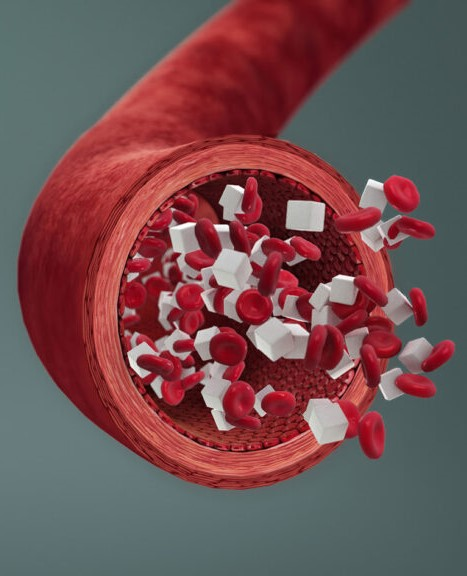
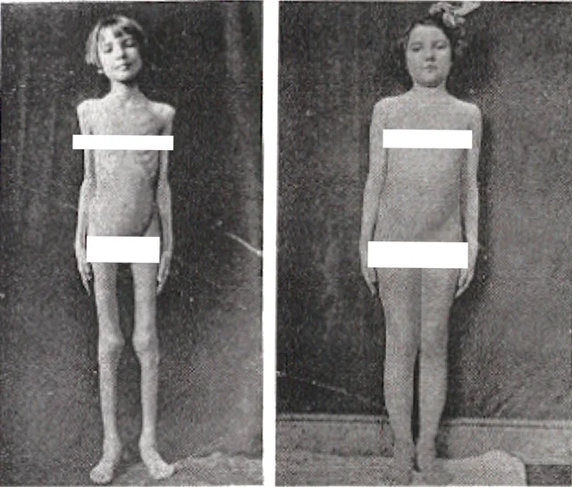
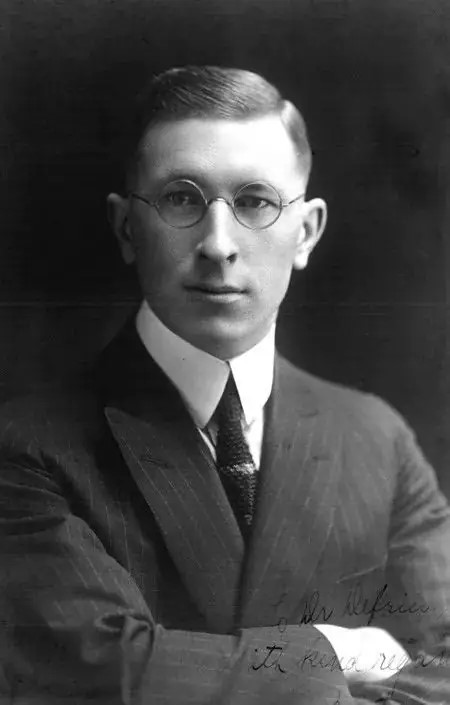
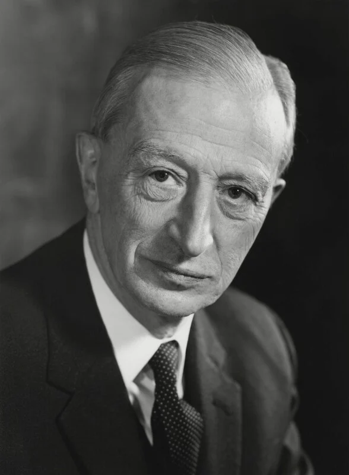
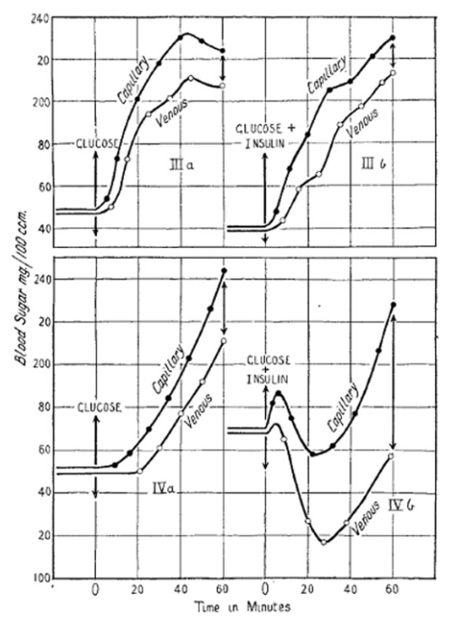
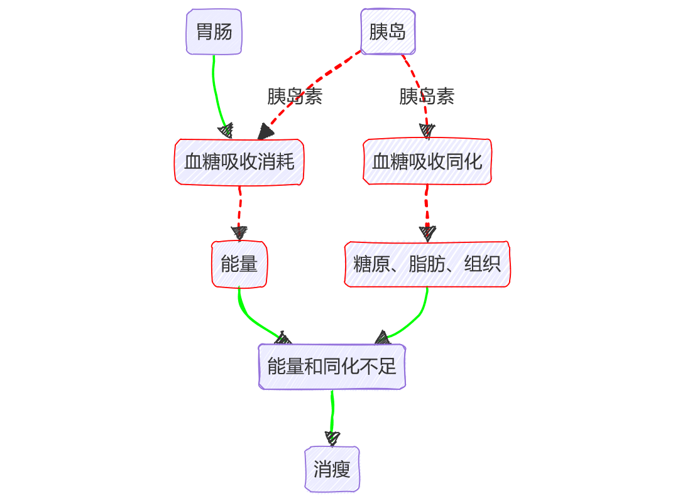
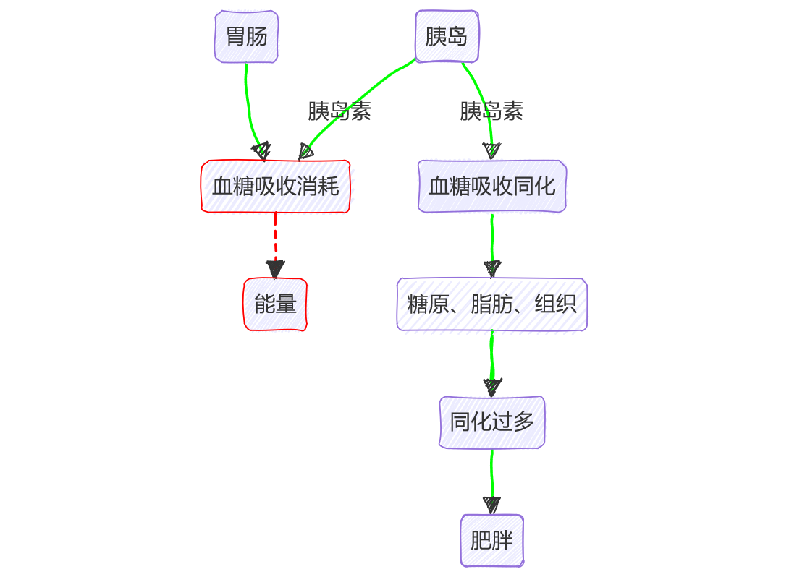
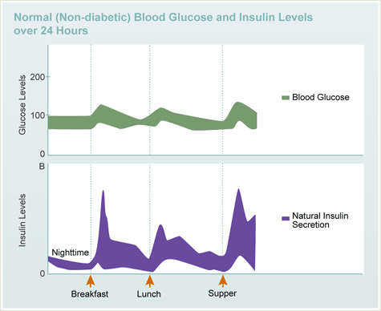
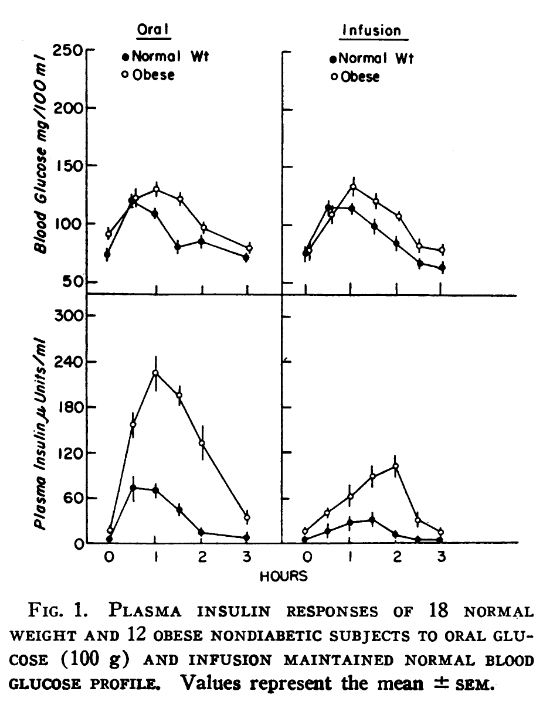
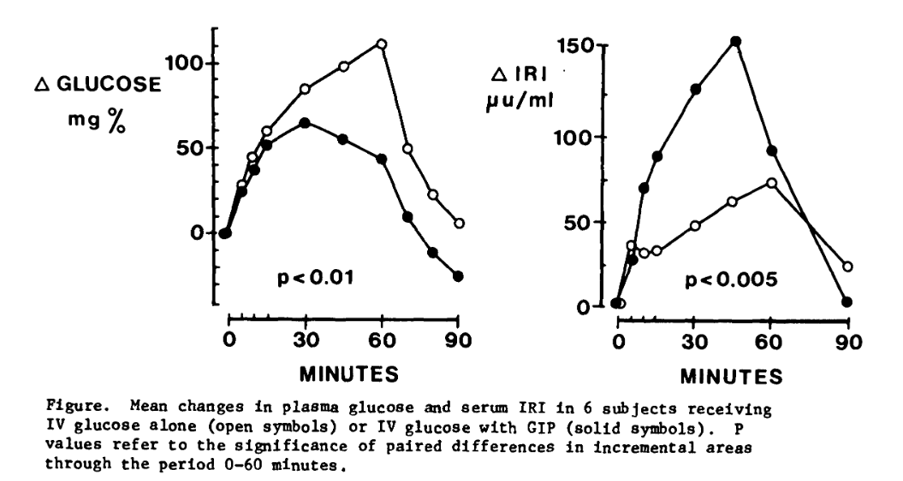

# **GLP-1与减肥新革命**
<h4 style="text-align:right">
——从糖尿病到体重调控的生理机制
</h4>

--- 

# 糖尿病的病理学史
## 真的是同一种病？

 

 

- 一型糖尿病患者：
    - 瘦骨嶙峋
    - 年轻
    - 对饮食非常小心

- 二型糖尿病患者：
    - 体重超重
    - 喜欢暴饮暴食
    - 往往偏爱高热量食品

<!-- 
糖尿病是一种非常特别的代谢性疾病，它的患者外表存在一个截然相反的现象。

我们知道，一型糖尿病患者一般瘦骨嶙峋，年轻，对饮食非常小心，少食。而二型糖尿病患者一般体重超重，体型偏胖，可能喜欢暴饮暴食，或者偏爱垃圾食品和可乐。
-->

--- 

# 糖尿病的病理学史
## 真的是同一种病？

共同点：
  - 长期慢性**高血糖**
  - 尿液中出现糖

<!-- 
但是这两种人，血液中都有无法控制的高血糖，以至于超出肾脏的处理能力，进而导致尿液中也出现糖。因此这两类人都属于 1500 年以前就有所记载的糖尿病患者。
-->

--- 

# 糖尿病的病理学史
## 真的是同一种病？

 

*一型糖尿病患者*

   

*二型糖尿病患者*

<!-- 
糖尿病作为最著名、最典型的代谢性疾病，它的患者身体代谢情况却如此不同，甚至向两个极端方向发展。这么胖瘦不一的两种人真的患同一种代谢性疾病吗？我们是不是搞错了什么？其中的关键，是不是隐含着我们对身体胖瘦调控的理解中缺少了什么？如果我们找到原因，找到这个关键，是否就能揭开身体调控胖瘦的秘密，然后去干预，从而达到我们想要的结果？
-->

---

# 糖尿病的病理学史
## 胰岛素的发现

- 班廷（Banting）于 1921 年发现并分离出胰岛素。

- 班廷因此成为诺贝尔生理医学奖有史以来最年轻的得主。

<!-- 
糖尿病虽然有上千年历史，但直到 1921 年，一直是一种患上就必死的绝症。其发病率不亚于其他绝症，比如癌症。医院的糖尿病病区充满了绝望的患者和家属，直接在那等死。直到 1921 年，多伦多大学的弗雷德里克·班廷和他的学生从前人的结果中得到启发，从狗的胰腺成功分离出胰岛素后，糖尿病才有了治疗的方法，而不再是必死的绝症。班廷因此成为诺贝尔生理学医学奖有史以来最年轻的得主。
-->

---

# 糖尿病的病理学史

## 胰岛素的作用机理

- 进入肝脏的血浆中胰岛素水平是进入其他组织的水平的三倍。

- 胃肠道吸收的营养也随着血液首先流向肝脏。

- 肝脏摄取了超过 $\frac{1}{3}$ 的总糖量摄入

<!-- 
胰岛素在被胰腺分泌出来后，首先会随着血液进入肝脏。进入肝脏的血液中胰岛素的浓度几乎是其他部位血液的三倍以上，而胃肠道吸收的营养也随着血液首先流向肝脏。显然肝脏和胰岛素之间有着密切关系。通过静脉插管在不同部位收集的血液比较可以发现，肝脏摄取了超过 $\frac{1}{3}$ 的总糖量摄入，几乎等同于全身肌肉的糖分消耗。
-->

---

# 糖尿病的病理学史

## 胰岛素的作用机理

- 血糖升高导致胰岛素释放

- 胰岛素调节细胞对糖的摄取

- 血糖得到控制

<!--  
经过类似诸多关键实验的证明，血糖升高导致胰岛素释放，增加肝脏储存吸收的糖分，肌肉和组织细胞摄取更多糖分而降低血糖。这种理解逐渐确立，显示胰腺和肝脏在控制血糖中的作用。随着人的三餐进食，血糖迅速升高，同样的胰岛素也迅速升高，然后把血糖降下来。糖尿病和胰岛素的故事似乎已经清晰地阐明了。事实上，真正的糖尿病机制还有很多未解之谜，而我们想要的身体调控肥胖的秘密更是千里之行，始于足下。
-->

---
# 糖尿病的病理学史
## 二型糖尿病治愈后的体型问题

- 一型糖尿病患者治愈后，体重增加，体型趋于正常。

- 二型糖尿病患者治愈后，体重增加，**体型更肥胖**。

<!-- 
在胰岛素开始用于医院治疗病人的上世纪 30 年代，人们发现胰岛素虽然能够暂时控制血糖，但胰岛素的替代疗法无法解决糖尿病晚期的各种并发症。而且不同人需要的胰岛素剂量也完全不同，准确控制血糖非常困难。瘦骨嶙峋的一型糖尿病患者经过治疗，血糖回归正常后，可以增加体重，使体型趋于正常。但是以肥胖为特征的二型糖尿病患者，经过治疗血糖回归正常后，体型不仅没有变正常，反而更肥胖。如果这种代谢问题只是血糖的问题，那么血糖恢复正常后，为什么体型不向正常发展呢？ 
-->

---
# 糖尿病的病理学史
## 胰岛素抵抗

希姆斯沃斯（Himsworth）做了一个打破人们认识的实验:

- 胰岛素和血糖同时注入人体静脉
- 精细控制血糖水平
- 得到控制每单位血糖需要多少单位胰岛素

<!-- 
1936 年，伦敦大学的 Harold Himsworth 教授做了一个彻底打破人们对糖尿病认识的实验。他的实验思路和方法是这样的：他将胰岛素和血糖同时注入人体静脉。此时若调节注入的血糖和胰岛素的量，让受试者血中的血糖维持稳定，这时，每分钟注入的血糖量和每分钟注入胰岛素的量的比值在不同人中会有截然不同的结果。这个比值代表了此人体内需要多少胰岛素才能控制血糖。也就是说，平均控制每单位血糖需要多少胰岛素，也就是对胰岛素的敏感性。需要胰岛素越少，控制的血糖越多，此人对胰岛素的敏感性越高。建立了胰岛素敏感性的概念后，人们发现糖尿病的身体血糖升高可能只是身体对胰岛素的敏感度降低了而已。
-->

---
# 糖尿病的病理学史
## 胰岛素抵抗

重新定义的糖尿病分型：
- 一型糖尿病：胰岛素分泌不足

- 二型糖尿病：胰岛素抵抗，胰岛素分泌正常

 
<!-- 
造成此敏感性降低的因素，Himsworth 教授当时称之为“某未知因素”。Himsworth 教授不仅跨时代地提出了糖尿病分型的医学病理基础，还用实验和数据证明了不同的糖尿病存在不同的胰岛素敏感性问题。Himsworth 教授的这个实验思路成为之后测量胰岛素抵抗的黄金标准。现在诊断糖尿病的糖耐量实验，其思路也大同小异：在口服一定葡萄糖后，在定点时间测量其血糖和胰岛素的变化，通过血糖变化和胰岛素分泌的量来测出糖尿病的情况。当他进食葡萄糖后，如果血糖控制得很好，那么就没有糖尿病。但如果血糖控制不好，比如血糖值很高，同时分泌的胰岛素也很多，说明他对胰岛素的敏感性很低，降低同样水平的血糖需要很多胰岛素，那么他就是一个二型糖尿病。
 -->

--- 

# 糖尿病的病理学史
## 体型差距的原因

 

*一型糖尿病患者*

   

*二型糖尿病患者*

<!-- 
胰岛素能增加组织对血糖的摄取，代谢转化成能量或储存为肝糖原脂肪组织。一型糖尿病患者由于没有胰岛素，吸收的糖分无法转化成脂肪或组织，因而瘦骨嶙峋。在代谢中，胰岛素是最重要的同化激素，和将食物变成糖、蛋白质、脂肪的异化作用相反，同化作用促使组织将糖、蛋白质、脂肪吸收转化为自我组织。在二型糖尿病中，由于胰岛素抵抗的存在，对胰岛素的敏感性很低，不仅血糖被外周组织摄取和利用受阻，肝糖原继续释放，脂肪细胞继续水解甘油三脂，进一步加重高血糖和高血脂。另一方面，血糖转化为内脏脂肪的同化作用也没有停止。结果是，为了降低血糖，代偿性分泌的过多胰岛素促进了同化作用，使患者越来越多的能量转化为自身组织，体型越来越肥胖。这就是为什么同为代谢性糖尿病的两种患者，身体代谢却呈现相反结果的原因。

我们一直认为这就是全部原因。现在我们可以进入近20年医学上自胰岛素发现以来最大的糖尿病突破，即治疗糖尿病药为何能在机理上调控肥胖，以及这样的调控是否值得我们每月花 1500 美元去尝试的问题。
-->

---

# 糖尿病的病理学史
## 全新的一环：胃肠道

- 按照理论，胰岛素高点出现在血糖高点之后

- 实验显示胰岛素和血糖高点同时出现

<!-- 
普遍认为，胰腺的β细胞通过血糖进入细胞后的一系列反应，让胰岛素随着血液的浓度释放，从而达到调控血糖的目的。

然而血糖的升高和胰岛素随着三餐的变化是在同一个高点的，而不是血糖先升高然后胰岛素滞后升高让血糖下降。
-->

---

# 糖尿病的病理学史
## 全新的一环：胃肠道

- 同一名研究对象
- 口服葡萄糖和静脉注射葡萄糖
- 血糖和胰岛素的变化不同

<!-- 
还有一个奇怪现象是，同一个研究对象无论口服葡萄糖还是静脉注射相同水平的葡萄糖，最终在体内达到相同的血糖，但胰岛素分泌量却不同，这和之前的理论相矛盾，被抑制的血糖量一样，但胰岛素分泌量不一样。这是什么原因呢？唯一解释是口服和静脉注射不同。口服不同在于什么呢？就是胃肠。答案似乎呼之欲出，一定有什么因素来自胃肠受到食物刺激，从而影响胰岛素的分泌。但到底是什么，却一直找不到让人信服的答案。
-->

---

# 糖尿病的病理学史
## 全新的一环：胃肠道

GIP（Gastric inhibitory polypeptide）
- 抑胃肽
- 直接影响胰岛素的释放

GLP（Glucagon-like peptide）
- 胰高血糖素样肽（类似胰高血糖素的多肽）
- 直接影响胰岛素的释放

<!-- 
直到六七十年代，随着分子生物学的发展，特别是放射免疫分析和酶联免疫等方法的发明，让人体内的各种蛋白多肽激素可以被分离和定量研究，科学家们才开始摸到一点门道。1973 年，一篇重磅文章证明了这一点：将分离出的、保持活性的胃肠分泌物 GIP 给健康受试者，直接观察到胰岛素分泌的明显变化，证明了胃肠分泌物能够直接影响胰岛素的释放。随后，类似胰高血糖素的免疫活性物质 GLP 也被发现，并证明了其促进胰岛素分泌的活性。更妙的是，这些分泌物在促进胰岛素分泌时，同时需要血糖水平的参与。也就是说，只有你在高血糖的时候，这些分泌物才能促进胰岛素分泌，它不存在用胰岛素降低血糖时常见的把患者血糖弄得太低，甚至可能危及生命的风险。这点在其作为药物的发展中起到了非常大的作用，我们之后再提。

如此，这个现象的发现后，针对胃肠分泌物 GIP 和 GLP 促进胰岛素分泌的研究迅速展开。人们发现，进食后胰岛素的分泌其实主要由这些胃肠分泌物主导，血糖升高对胰岛素分泌的刺激仅占 1/14。也就是说，之前的糖尿病机制解释只包含了其中不到 1/14 的机制，由于胰腺问题导致胰岛素分泌不足引起血糖升高。这样的糖尿病认知是不是有根本的错误？比如，血糖变化主要由进食导致，胰岛素分泌主要依靠胃肠刺激，似乎比我们认为的围绕肝脏-胰腺-血糖的循环作用和信号通路要合理有效得多。对糖尿病的理解，我们似乎有根本上的一些问题。有没有可能是胃肠分泌不足，或者分泌物不起作用，从而对胰岛的刺激不足，使糖尿病的病因其实是胃肠问题，而不是胰腺问题？
-->
