# **GLP-1与减肥新革命**
<h4 style="text-align:right">
——从糖尿病到体重调控的生理机制
</h4>

<!-- 
不知道大家有没有过体重上的焦虑，像是吃完一些高热量的食物充满负罪感之类的啊。

然而不管一个正常人有多么焦虑，在听到减肥药这个名词时，他大概会认为都是智商税。

可是如果今天我告诉你有一种减肥药，他不仅在科学上有着非常强大的证据支持，而且还是大量明星和富豪们这些阶层的人敢用的药，大家还会不会考虑去尝试一下呢？
-->

---

<!--
这是前年7月世界首富马斯克在希腊参加派对，在现场被偷拍几张照片。这几张照片在网上迅速传播，不是因为照片有多么好看，而是因为马斯克这一身雪白肥肉太引人注目，完全颠覆了人们对他精神抖擞、商界精英的印象，让大家大跌眼镜，纷纷转发吐槽。
-->

---

<!--
就在不久之后，这张照片在马斯克常用的推特上引发了舆论的热议，各大媒体也开始纷纷转载报道。马斯克被大量@，他把比尔·盖茨拉出来拉踩，这句话的大意是“你看他也这么胖，为什么只有我被说”。
正当乐子人准备在互联网掀起一场大战时，不到一个月后，马斯克在推特上正式宣布，他在朋友的帮助下已经开始节食减肥，感觉自己feel healthier，并且已经成功减了20磅（也就是大概9000克）。

一个月内，网友不断追问，马斯克终于不再隐瞒，直接公开了他的秘密武器——减肥神药Wegovy。
-->

---

<!--
于是网友发现，这个Wegovy正是最近被大肆吹捧的减肥神药，其主要成分是司美格鲁肽，而同样成分的药物Ozempic用于治疗糖尿病。由于它被疯狂的滥用，在美国引起了不小的狂潮。
-->
---
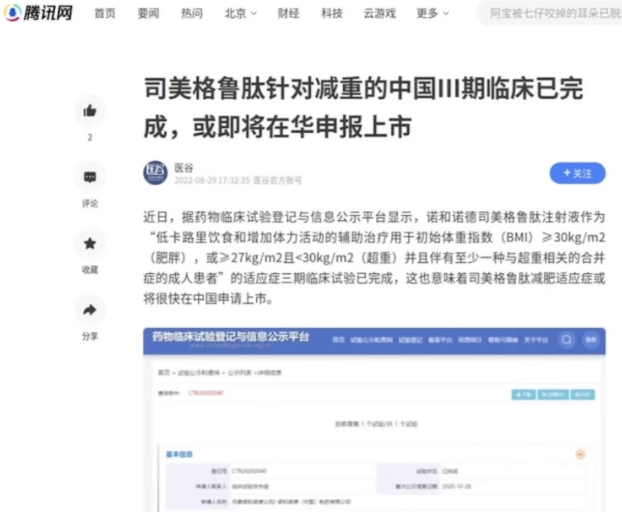
<!--
前年上半年，国内也完成了此药治疗肥胖的三期临床实验，现在已经成功上市。
-->

---

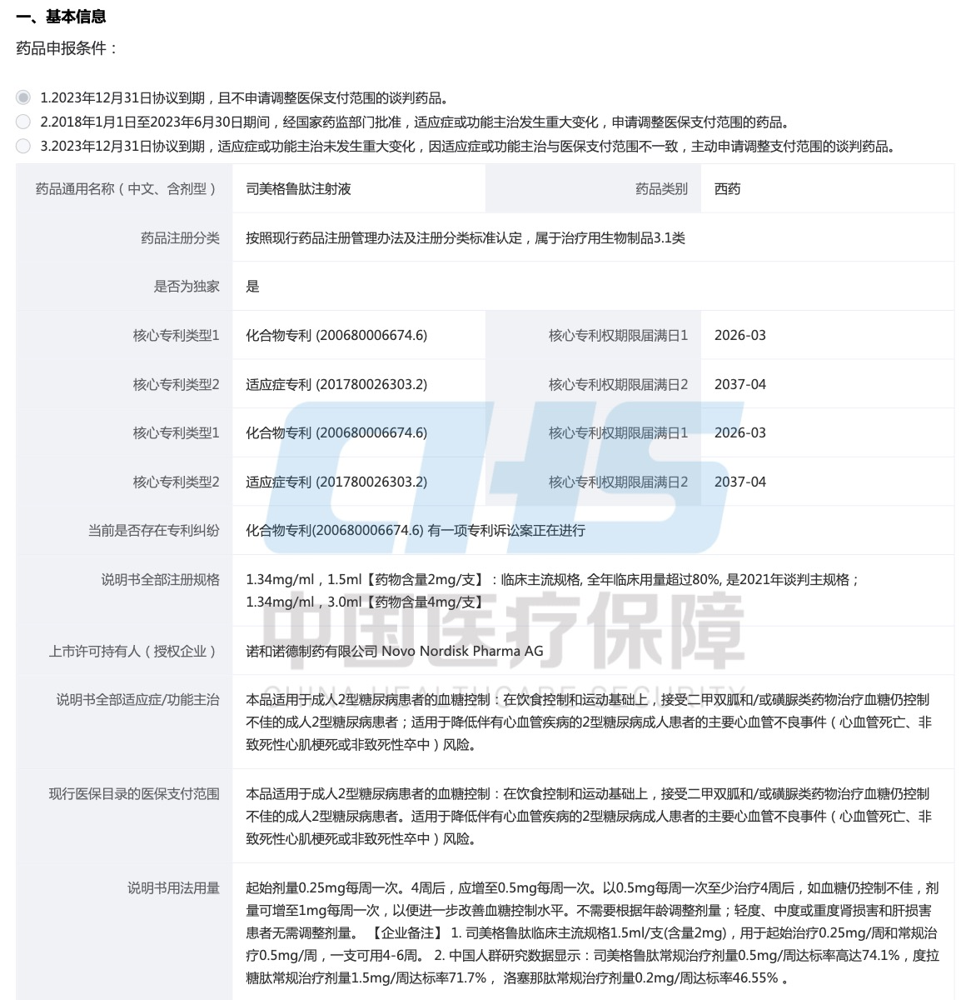

<!--
而在此之前，这个药已经针对糖尿病获批上市，甚至纳入了医保。所以说，我们只要吃上和世界首富同样的保健减肥药，就能彻底告别肥胖的烦恼吗？

所谓“减肥神药”的闹剧在国内已经上演过多次，通常以悲剧告终。但这次，这个药不仅来自世界医药巨头诺和诺德，还获得了美国药品监督管理局特别针对减肥药的批准上市。
-->
---

<!--
连马斯克都觉得效果超级好，忍不住狂发推特免费为这个药代言，并且有图有证据，可以看到她确实是在一个月内暴瘦，所以说，这个药肯定没问题了，是这样吗？
-->

---

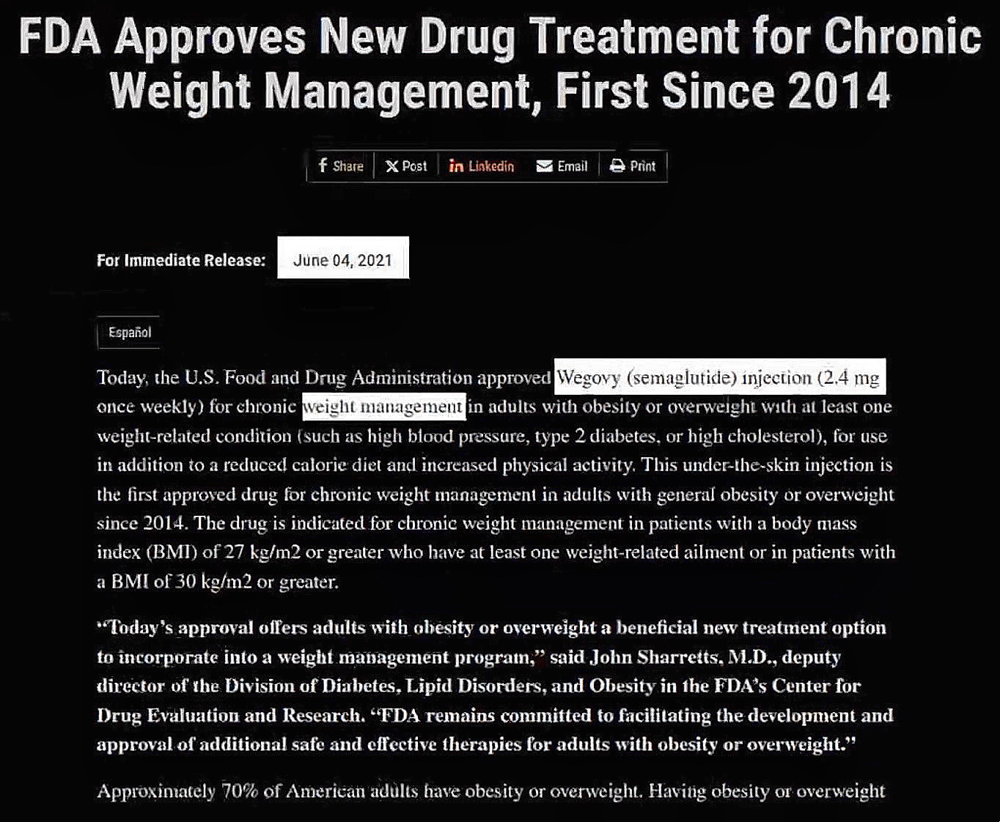
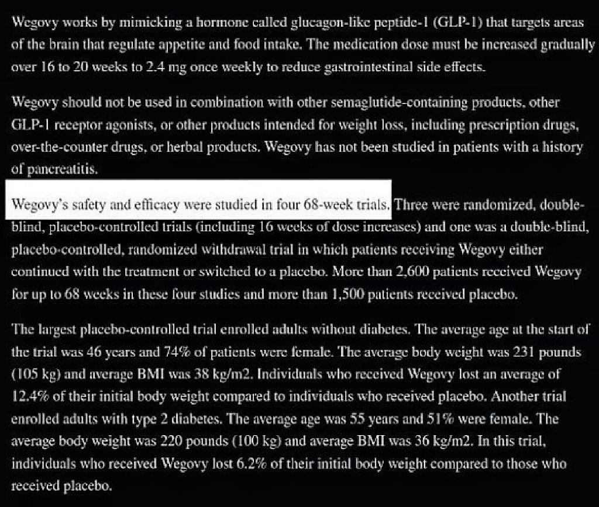
<!--
这一切似乎很玄幻，让人想再看看具体情况。此药到底靠不靠谱，可以从美国食品药监局（FDA）的页面查看批准它上市的核心证据，也就是临床研究的结果。通过4个长达68周的临床研究，观察参与研究的患者吃药后的效果，我们就能知道这药具体如何了。

它的4个临床研究中，3个是公认说服力最强的双盲随机对照研究。
-->
---
# Step 1 Trial

- **实验组体重迅速降低**

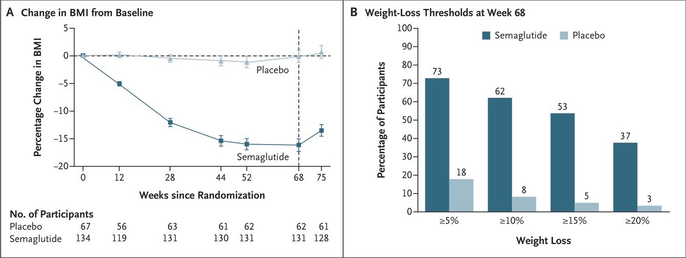
<!--
比如最重要的第一个Step one trial，大概有2000个患者参与了实验，发表在最权威的新英格兰医学杂志上，该实验的结果只能用梦幻般的完美来形容：注射司美格鲁肽的实验组和对照组的体重变化如图显示，体重迅速降低，左边这张图是BMI下降的百分比图，右边这张图是不同的体重减轻比例的柱状图，可以看到左边这张图实验组的BMI也是迅速降低，右边这张图也差不多，甚至有将近40%的人体重减轻了20%。
-->
---
# Step 4 Trial

- **继续用药组体重持续下降**
- **停药组体重迅速反弹**
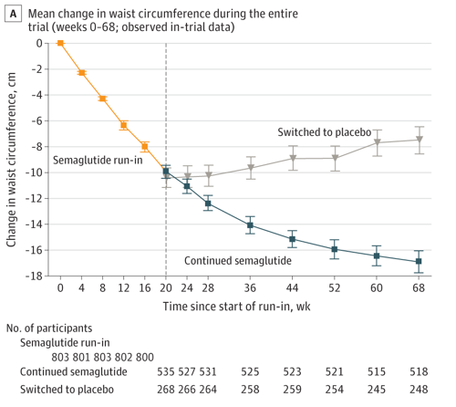

<!--
这个结果一直到最后的Step 4 trial依然非常具有说服力。Step 4的实验方法依然是双盲，但换成了所有人都用药，然后在中途随机分成继续用药和停药的两组，看他们体重的变化，验证药物是否真的有效。刚开始大家都用药，然后从中点开始，一组继续用药，一组停药。可以看到，继续用药的人体重继续下降，而停药的人体重立即停止下降。结果显示这个药确实很有效，这两张ppt的两张图中，继续用药的人BMI降低的比例几乎像一段双曲线。

也许正因为这样完美的结果，除了美国外，欧洲、日本等药监局也批准它作为减肥药上市。看起来这个药相当的靠谱啊，但问题是，临床实验效果好，实际用起来真的有效吗？既然在国内上市了，我们也去买来吃，也会迅速降低体重吗？
-->

---
# “生活干预” & 副作用
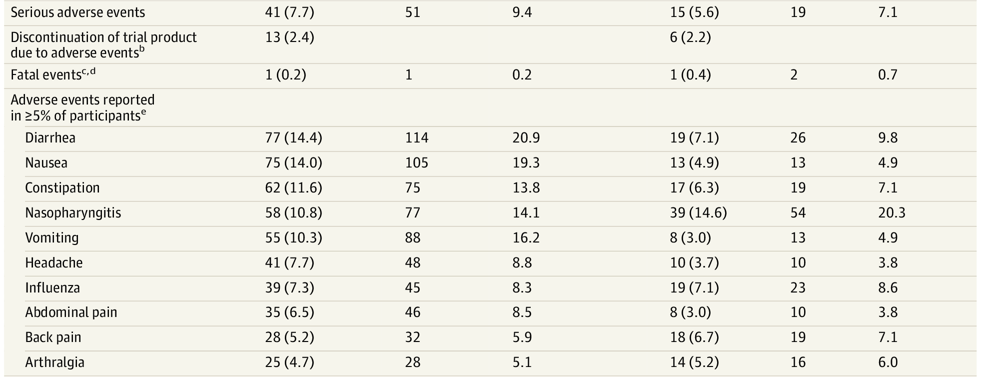
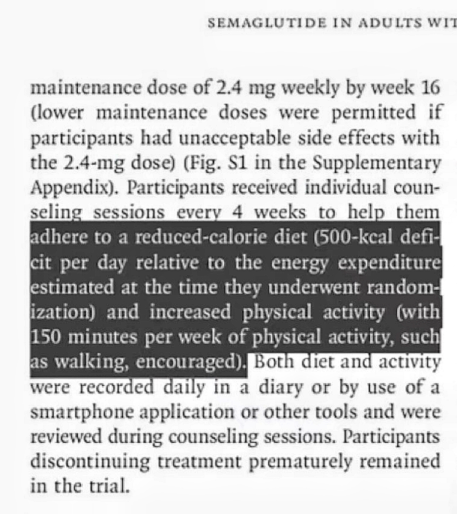
<!--
这些临床实验当然不能只看结果，还要看一些别的，比如说副作用、实验的设计、实验中途被迫退出的人等等。比如实验的流程，是否本来设计上就有一些小巧思，让它更利于做出更好的结果呢？
从实验的细节上可以看出，4个临床实验的实验组和对照组除了用药，还加了所谓的 生活干预 。那什么叫生活干预呢？右边这张图可以看到，每个人都有个人教练，每个月一对一对的对参与者进行节食指导，并且每周进行150分钟以上的锻炼培训。参与者还需要每天都在手机上记录自己的节食和锻炼情况，由教练进行监督和指导。而且在这个长达快一年的时间里，全程都需要完成这些事情。可以想象，能够愿意参加并且顺利完成实验的受试者，对减肥的积极性或者说动力本来就是十分充足的，服从性比一般人要好很多。所以说，本实验的受试者本来就存在一些选择性偏差，这样的结果在一般人群中就不一定能复制了。

另外，左边这张图是药物副作用的表，记录了副作用发生的情况。可以看到，用药组有高达44%的人出现了恶心，快三分之一的人出现了腹泻，四分之一的人出现了呕吐症状，而因副作用不得不退出的人数甚至是对照组的两倍。
-->
---
# Step 4 trial

- **继续用药组体重持续下降**
- **停药组体重迅速反弹**

<!--
而之前看到的Step 4的实验结果，右边这个图也暴露了此药一个更大更致命的问题：假设这个药真的那么神奇，一般人继续吃药，体重确实会持续降低；但是可以看到，实验中途开始停药的对照组人体重也是迅速反弹上来了，可以预计时间长了就几乎会恢复到实验刚开始的水平。
而且要知道，这两组实验组和对照组都是在非常严格的生活干预情况下进行实验，也就是说即使你停药了，还是有一对一的教练跟进，监督你节食锻炼、帮你改善生活方式和饮食，但在这种情况下你的体重依然会迅速反弹。那么如果你想继续让体重降低，可能还是需要继续吃药，吃多久呢？可能是一辈子。
而这个药的价格也是非常惊人，每月大概需要1500刀，换算成人民币就是每月一万一千元。
-->

---

<!--
而之前我们说过，司美格鲁肽这个药在国内已经上市并且加入了医保。现在我们仔细看下这个申报材料。
-->
---

<!--
这里面说，本品适用于二型糖尿病的血糖控制，也就是说这个药作为医保的项目是针对二型糖尿病的控制的。所以在探究减肥相关的问题之前，我们好像忘了一个更严重的问题，这个减肥药其实是二型糖尿病药。

为什么治疗糖尿病的药却成了减肥药？如果没有糖尿病去吃这个药，也就是没有病却要吃治病的药，这到底靠谱吗？

要判断这个问题，我们还得从此药的减肥原理说起。如果能理解这其中的逻辑，也许更能帮助判断用这药来减肥到底靠谱与否。

糖尿病看似简单的病理，其实隐含着人类梦寐以求的、让身体主动减肥的秘密。如果能弄清楚与糖尿病有关的人体生理、病理逻辑，最终可能指向下一个更有效的减肥方法。
-->

---

# 糖尿病的病理学史
## 真的是同一种病？

 

 

- 一型糖尿病患者：
    - 瘦骨嶙峋
    - 年轻
    - 对饮食非常小心

- 二型糖尿病患者：
    - 体重超重
    - 喜欢暴饮暴食
    - 往往偏爱高热量食品

<!-- 
糖尿病是一种非常特别的代谢性疾病，这个病存在一对截然相反的现象。

我们知道，一型糖尿病的患者，一般非常瘦，往往比较年轻，而且在饮食非常注意，吃的也很少。而二型糖尿病的患者则往往相反，超重，喜欢暴饮暴食，偏爱垃圾食品。
-->

--- 

# 糖尿病的病理学史
## 真的是同一种病？

共同点：
  - 长期慢性**高血糖**
  - 尿液中出现糖

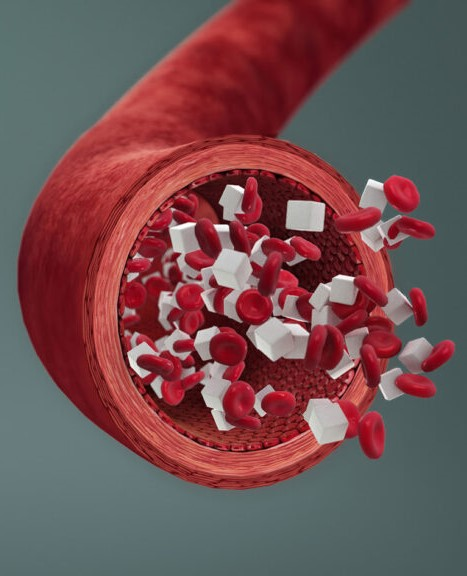

<!-- 
之所以说他们得的是 同一种病，是因为这两种人的血液中，都有着无法控制的高血糖，甚至高到超出了肾脏的处理能力，使得尿液中出现糖。
-->

--- 

# 糖尿病的病理学史
## 真的是同一种病？

 

*一型糖尿病患者*

   

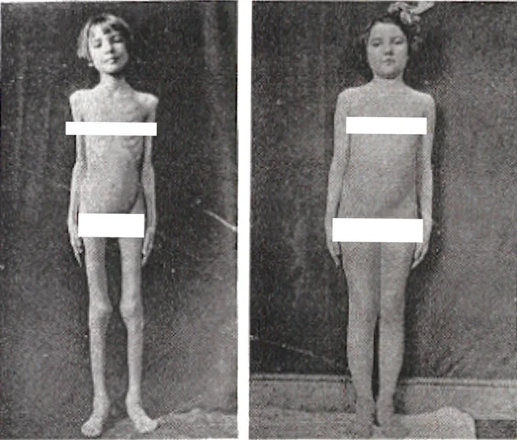

*二型糖尿病患者*

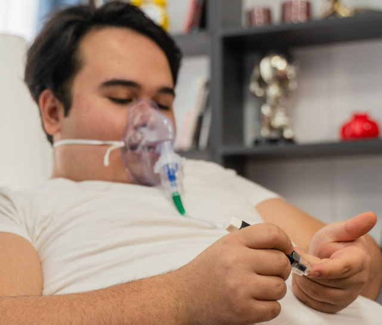

<!-- 
糖尿病作为一种代谢性疾病，它的患者的代谢情况却如此不同，甚至可以说，两种患者的体形向着两个极端的方向发展。这么两种人真的患的是同一种病吗？我们有没有搞错什么？是不是我们对人体体重调控的理解缺少了什么？如果我们找到其中缺失的一环，是否就能揭开这个的秘密，并且有能力去干预，从而达到我们想要的结果？
-->

---

# 糖尿病的病理学史
## 胰岛素的发现

- 班廷（Banting）于 1921 年发现并分离出胰岛素。

- 班廷因此成为诺贝尔生理医学奖有史以来最年轻的得主。

<!-- 
糖尿病虽然有上千年历史，但是直到 1921 年，一直是一种患上就必死的绝症。其发病率不亚于其他常见的绝症，比如癌症。直到 1921 年，多伦多大学的班廷和他的学生从前人的成果中得到启发，从狗的胰腺成功分离出胰岛素。在此之后，糖尿病才有了治疗的方法，而不再是必死的绝症。

这位班廷也因此拿到了诺奖，成为诺贝尔生理医学奖有史以来最年轻的得主。
-->

---

# 糖尿病的病理学史

## 胰岛素的作用机理

- 进入肝脏的血浆中胰岛素水平是进入其他组织的水平的三倍。

- 胃肠道吸收的营养也随着血液首先流向肝脏。

- 肝脏摄取了超过 $\frac{1}{3}$ 的总糖量摄入

<!-- 
胰岛素在被胰腺分泌出来后，首先会随着血液进入肝脏。其中胰岛素的浓度几乎是其他部位血液的三倍以上，而胃肠道吸收的营养首先流向肝脏。

很显然肝脏和胰岛素之间，应该是存在着密切关系的。科学家们通过比较在不同部位收集的血液发现，肝脏摄取了超过人体摄入总糖量的 1/3。作为对比，人全身肌肉的糖分消耗量也就是总糖量的 1/3 
-->

---

# 糖尿病的病理学史

## 胰岛素的作用机理

- 血糖升高导致胰岛素释放

- 胰岛素调节细胞对糖的摄取

- 血糖得到控制

<!--  
经过诸多实验的证明，血糖升高会促进胰岛素的释放。胰岛素则促进肝脏、肌肉和组织细胞u摄取血液中的葡萄糖。这种理论强调了胰腺和肝脏在控制血糖中的作用。糖尿病和胰岛素的故事似乎已经清晰地阐明了：人在吃东西后，血糖迅速升高，进而导致胰岛素也迅速升高，好把血糖降下来。

然而事实上，真正的糖尿病机制还有很多的未解之谜。
-->

---
# 糖尿病的病理学史
## 二型糖尿病治愈后的体型问题

- 一型糖尿病患者治愈后，体重增加，体型趋于正常。

- 二型糖尿病患者治愈后，体重增加，**体型更肥胖**。

<!-- 
在上世纪 30 年代，胰岛素开始被用于治疗糖尿病。在这过程中，人们发现胰岛素虽然能够暂时控制血糖，但单纯注射胰岛素无法解决糖尿病晚期的各种并发症。而且不同的人需要的剂量也完全不同，准确地控制血糖非常困难。一型糖尿病患者经过治疗，血糖回归正常后，体型从消瘦回归正常。但是以肥胖为特征的二型糖尿病患者，体型不仅没有变正常，反而更胖了。

如果糖尿病只是血糖的问题，那么血糖恢复正常后，为什么二型患者的体型没有变正常呢？ 
-->

---
# 糖尿病的病理学史
## 胰岛素抵抗

希姆斯沃斯（Himsworth）做了一个打破人们认知的实验:

- 胰岛素和血糖同时注入人体静脉
- 精细控制血糖水平
- 得到控制每单位血糖需要多少单位胰岛素

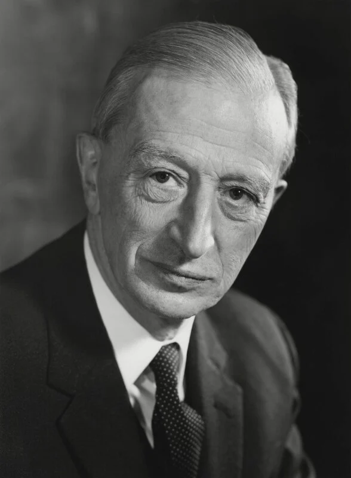

<!-- 
1936 年，伦敦大学的 Harold Himsworth 教授做了一个彻底打破人们对糖尿病认识的实验。

他的实验思路和方法是这样的：他将胰岛素和血糖同时注入人体的静脉。此时不断调节注入的血糖和胰岛素的量，让受试者血中的血糖维持稳定，然后记录下每分钟注入的血糖量和胰岛素的量的比值，这个比值代表了此人体内需要多少胰岛素才能控制血糖，也就是人体对胰岛素的敏感性。建立了胰岛素敏感性的概念后，人们发现长期高水平的血糖可能只是身体对胰岛素的敏感度降低了而已。
-->

---
# 糖尿病的病理学史
## 胰岛素抵抗

重新定义的糖尿病分型：
- 一型糖尿病：胰岛素分泌不足

- 二型糖尿病：胰岛素抵抗，胰岛素分泌正常

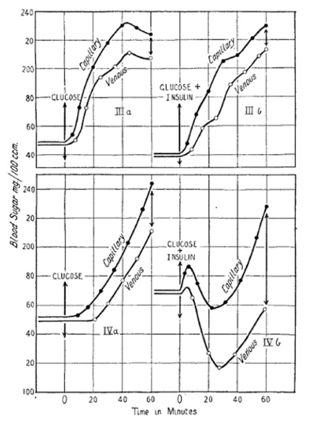
 
<!-- 
造成此敏感性降低的因素，Himsworth 教授当时称之为“某未知因素”。Himsworth 教授不仅跨时代地提出了糖尿病分型的医学病理基础，还用实验和数据证明了不同的糖尿病存在不同的胰岛素敏感性问题。这个实验思路成为之后测量胰岛素抵抗的黄金标准。现在诊断糖尿病的糖耐量实验，其思路也大同小异：在口服一定葡萄糖后，在定点时间测量其血糖和胰岛素的变化，通过血糖变化和胰岛素分泌的量来测出糖尿病的情况。当他进食葡萄糖后，如果血糖控制得很好，那么就没有糖尿病。但如果血糖控制不好，比如血糖值很高，同时分泌的胰岛素也很多，说明他对胰岛素的敏感性很低，那么他就是一个二型糖尿病。
 -->

--- 

# 糖尿病的病理学史
## 体型差距的原因

 

*一型糖尿病患者*

   

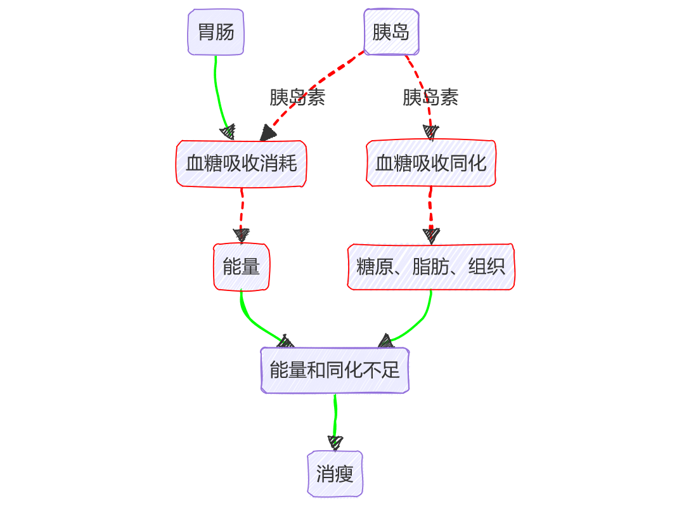

*二型糖尿病患者*

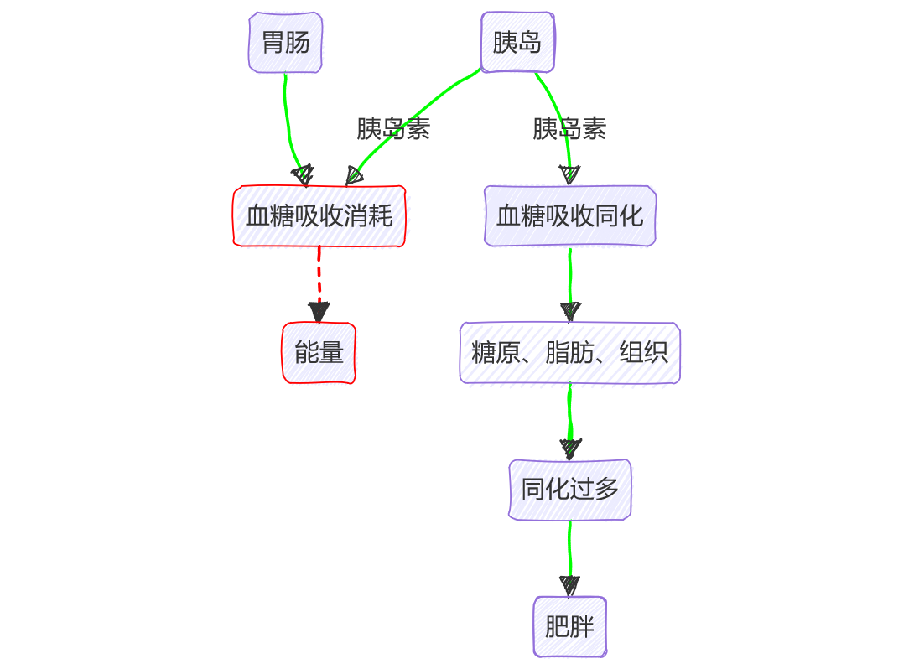

<!-- 
一型糖尿病患者由于胰岛素不够，吸收的糖分无法转化成脂肪或组织，因而非常瘦。

在代谢中，胰岛素是最重要的同化激素。和分解体内大分子的异化作用相反，同化作用促使生物将糖、蛋白质、脂肪吸收转化为自我组织。在二型糖尿病中，由于胰岛素抵抗的存在，外周组织摄取和利用血糖受阻。另一方面，血糖转化为内脏脂肪的同化作用也没有停止。结果是，为了降低血糖，代偿性分泌了过多的胰岛素，极大地促进了同化作用，使患者越来越多的能量转化为自身组织，体型越来越胖。

这就是患同一种病的两种患者，身体代谢却呈现相反结果的原因。

我们一直认为这就是全部原因。但是又一个突破打破了这种认知。

现在我们可以进入近20年医学上自胰岛素发现以来最大的糖尿病突破。
-->

---

# 糖尿病的病理学史
## 全新的一环：胃肠道

- 按照理论，胰岛素高点出现在血糖高点之后

- 实验显示胰岛素和血糖高点同时出现

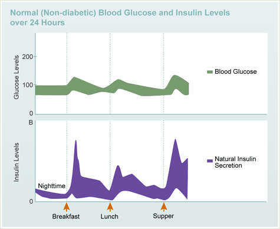

<!-- 
曾经大家普遍认为，血糖进入胰腺的β细胞后，β细胞通过一系列反应，让胰岛素随着血液的浓度动态释放，从而达到调控血糖的目的。

然而在进食后，血糖和胰岛素水平峰值却是在同一个时间点出现的，而不是血糖先升高然后胰岛素滞后升高让血糖下降。
-->

---

# 糖尿病的病理学史
## 全新的一环：胃肠道

- 同一名研究对象
- 口服葡萄糖和静脉注射葡萄糖
- 血糖和胰岛素的变化不同

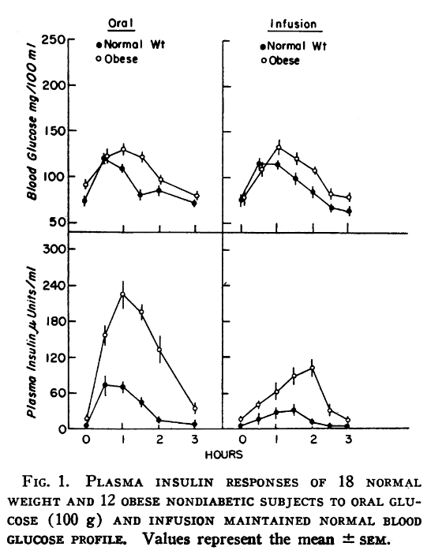

<!-- 
还有一个奇怪现象是，同一个研究对象分别口服葡萄糖和注射相同水平的葡萄糖，虽然最终在体内达到相同的血糖，但胰岛素分泌量却不同，这和之前的理论相矛盾，被抑制的血糖量一样，但胰岛素分泌量不一样。

如果我们仔细想想其中的区别。唯一解释是口服和注射不同。口服和注射不同在于什么呢？其实是有没有经过胃肠道。

答案似乎已经很明显了，一定是胃肠道的某个因素影响了胰岛素的分泌。但到底是什么，学界却一直没找到让人信服的答案。
-->

---

# 糖尿病的病理学史
## 全新的一环：胃肠道

**GIP（Gastric inhibitory polypeptide）**
- 抑胃肽
- 直接影响胰岛素的释放

**GLP（Glucagon-like peptide）**
- 胰高血糖素样肽（类似胰高血糖素的多肽）
- 直接影响胰岛素的释放

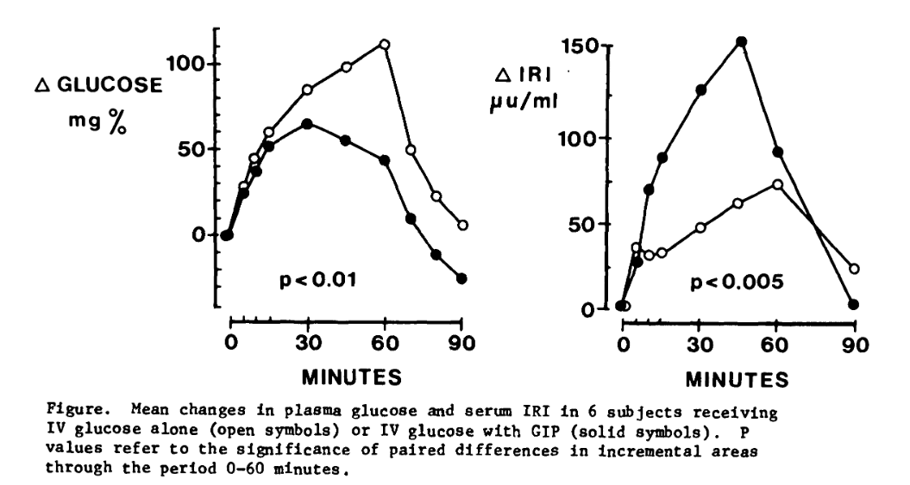

<!-- 
直到上世纪六七十年代，随着分子生物学的发展，特别是放射免疫分析和酶联免疫等方法的发明，让人体内的各种蛋白多肽激素可以被分离和定量研究，科学家们才开始摸到一点门道。1973 年，一篇重磅文章证明了这一点：将分离出的、保持活性的胃肠分泌物 GIP 给健康受试者，直接观察到胰岛素分泌的明显变化，证明了胃肠分泌物能够直接影响胰岛素的释放。随后，类似胰高血糖素的免疫活性物质 GLP 也被发现，并被证明其有促进胰岛素分泌的活性的作用。

更妙的是，这些分泌物在促进胰岛素分泌时，同时需要血糖水平的参与。也就是说，只有你在高血糖的时候，这些分泌物才能促进胰岛素分泌，它不存在用胰岛素降低血糖时常见的把患者血糖弄得太低，甚至可能危及生命的风险。这点在其作为药物的发展中起到了非常大的作用，我们之后再提。

针对胃肠分泌物 GIP 和 GLP 促进胰岛素分泌的研究迅速展开。

人们发现，进食后胰岛素的分泌其实主要由这些胃肠分泌物主导的，血糖升高对胰岛素分泌的刺激仅占 1/14。也就是说，之前的我们对糖尿病病理的解释只包含了其中 1/14 左右的机制。

血糖变化主要由进食导致，因此胰岛素分泌主要依靠胃肠道的刺激，似乎比我们认为的肝脏-胰腺-血糖的循环和信号通路要合理得多。

那么糖尿病有没有可能是胃肠分泌物不足，或者分泌物不起作用，从而对胰岛的刺激不足，使糖尿病的病因其实是胃肠问题，而不是胰腺问题？
-->

---

# GLP 受体激动剂

- 口服生物利用度低

- 会依赖血糖高低自动促进胰岛素分泌
    - 不需要随着进食注射

- 作用范围广
    - 广泛存在于外周神经、脑、肾、心、肝、骨骼肌

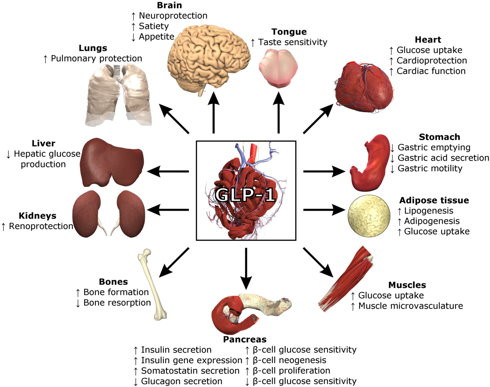

<!--
胃肠分泌物促进胰岛素分泌，成为新的糖尿病治疗靶点。

药厂们已经开始行动，他们的目标是针对二型糖尿病仍然有效的GLP，而我们演讲的主题——司美格鲁肽正是几十年GLP受体激动剂研究的结晶。与胰岛素类似，GLP是通过口服会被消化破坏的多肽，因此注射是唯一办法。它不需要随着进食注射，因为它会依赖血糖高低促进胰岛素分泌，不用担心过量注射导致低血糖的紧急情况。药物发展从最早的一天两次注射，到通过肾脏清除和降解的不断改进，司美格鲁肽在人体的半衰期达到惊人的160小时，即注射时间从一天两次减至每周一次。

为什么药厂如此奋不顾身、前仆后继地研究和改善这个GLP受体激动剂？因为这个GLP受体激动剂在临床实验中的作用范围实在是太广了。地球生物千百万年进化，最核心的功能无非是繁殖和进食，而血糖调控失败是进食后一系列复杂代谢功能出问题的产物。如果糖尿病是人类最广泛存在的代谢性疾病，其病理核心是胃肠，其信号传导核心分泌物是GIP和GLP，那么这两个物质的功能可能远不止促进胰岛素分泌那么简单。血糖升高可能只是哺乳动物最核心功能调控紊乱的外在迹象。

在针对GLP的实验刚开始时，GLP1受体就被发现广泛存在于外周神经和大脑。动物实验发现其广泛存在于脑、肾、心、肝和骨骼肌。也就是说，GLP的作用地方很多，不只是胰腺。这些发现为GLP受体激动剂在临床实验中出现各种神奇作用奠定了基础。
-->

---

<!--
而GLP究竟为什么能减肥呢？其作用机制，来自中枢神经对饱腹感等感觉的干涉。
-->

# GLP 受体激动剂
## 干涉饱腹感

 

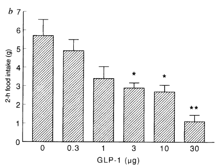

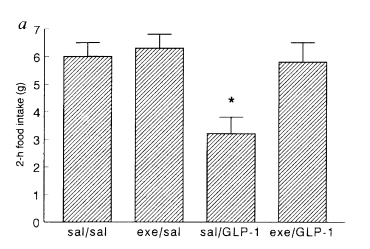

小鼠实验
- GLP-1
- sal：生理盐水
- exe：特异性GLP-1受体拮抗剂exendin ，阻断GLP-1对食物摄入的抑制作用

<!--

这张图描述了当给小鼠注射GLP-1后，两小时内小鼠主动进食摄取食物量的变化，可以看到，随着GLP注入的增加，小鼠主动进食量减少。

而在另一个实验中，实验人员引入了特异性GLP-1受体拮抗剂exendin ，它能够阻断GLP-1对食物摄入的抑制作用。从图中可以看到，单独使用exe对快速诱导进食没有影响。单独使用GLP-1能降低小鼠一半的食欲。而通过同时使用exe和GLP-1，通过exe的抑制GLP-1受体作用，小鼠的食欲大致恢复到了只使用生理盐水时的水平。

-->

---
# GLP 受体激动剂
## 干涉饱腹感

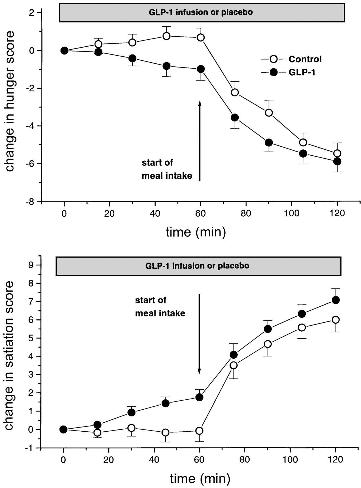
2 型糖尿病患者实验
- 静脉注射GLP-1后
  
  - 饱腹感增强
  - 食欲衰退
<!--

在一项对 12 名 2 型糖尿病患者中进行了一项双盲、安慰剂对照、交叉研究，(通过视觉模拟量表）来评估静脉注射 GLP-1 对食欲和饱腹感影响 的实验中，可以发现，静脉注射GLP-1后，饱腹感增强，食欲衰退。

这些发现表明，中枢 GLP-1 是一种新的饱足感生理调节剂。

-->

---

# GLP 受体激动剂
## 保护心血管

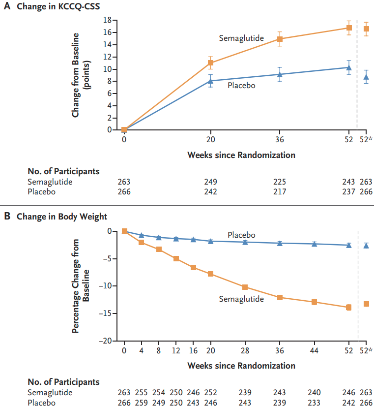

- KCCQ-CSS
  - higher scores indicating fewer symptoms and physical limitations

<!--

除了GLP-1通过影响饱腹感作用于减肥以外，在一项临床实验中发现，GLP-1除了降低血糖外，还表现出明显的心血管保护作用。
KCCQ-CSS是衡量心血管疾病的一个综合指标。KCCQ-CSS越高，说明心血管疾病负面症状越少。

更甚者，由于GLP受体在下丘脑表达，通过多巴胺神经元损伤的模拟实验，发现此药物能够保护神经元细胞。也就是说，GLP的发掘甚至能为治疗阿尔茨海默症、帕金森症带去新的希望。

-->

---

# GLP 受体激动剂
## GLP-1：2023 年度科学突破

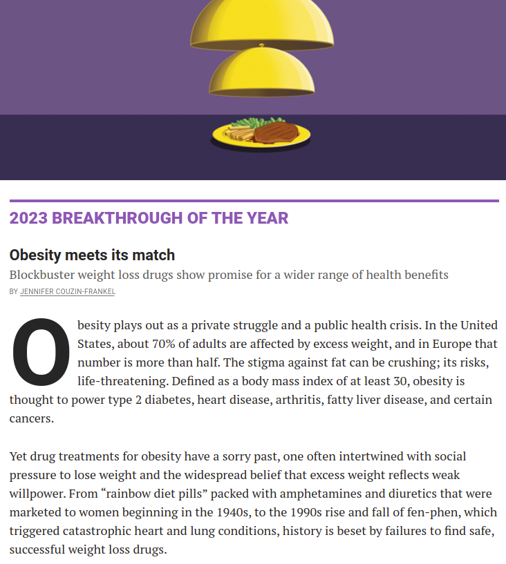

<!--

在2023年年度科学突破评选中，评委们选出了GLP-1作为2023年的年度科学突破。随着司美格鲁肽对体重改善的临床实验结果，药厂们成功申请了司美格鲁肽在体重管理方面的适应证，在美国批准上市。于是有了我们开篇的马斯克的减肥神药Wegovy，也就是司美格鲁肽。继欧美批准上市后，司美格鲁肽继续在中国申请肥胖适应证的批准上市。
-->

---

# GLP 受体激动剂
## 停药后bmi反弹

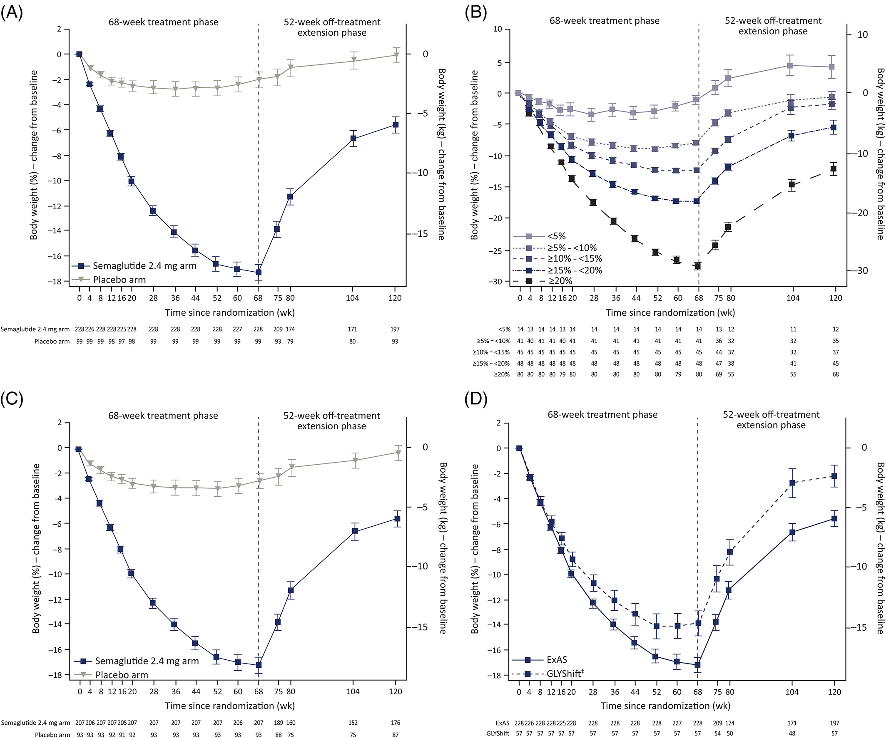

<!--
现在回到我们最初的司美格鲁肽作为减肥药批准上市的临床实验.
在停止每周一次的皮下注射司美格鲁肽和生活方式干预一年后，参与者的体重恢复到了减重前的三分之二。而在两年后，体重几乎完全恢复到减重前的水平。

而且如之前提到的，这个实验组和对照组都是对减肥非常有积极性的人。可以想象这些人在退出实验后，经过长达一年的一对一教练培训，自然还会坚持一段时间节食和锻炼，但他们的体重依然迅速反弹。这样看来，一旦不长期使用司美格鲁肽，bmi就必然会反弹。

研究结果证实了肥胖需要持续治疗并服用药物，才能长期改善体重和健康。

-->

---

# GLP 受体激动剂

## 副作用

- 甲状腺癌
- 胰腺炎
- 胆囊结石
- 抑郁
- 自杀倾向等

<!--
在Wegovy官网可以看到，他们明确地对各种副作用进行警告。除了第一临床实验提到的各种胃肠反应外，还有甲状腺癌、胰腺炎、胆囊结石、抑郁、自杀倾向等，他们也将家族史甲状腺癌作为禁忌症。即使这样的副作用，加上一个月1500美元的高价，人们还是对司美格鲁肽趋之若鹜。

司美格鲁肽在国内作为减肥药的上市审批已经开始。在欧美批准BMI30以上的减肥适应证后，各大药厂迅速推出自己的GLP1激动剂，这个百亿级别的减肥市场注定爆发下一场革命。
 -->

 ---

<!--
胰岛素的发现让全球数百万糖尿病人获救，而这次GLP1受体激动剂的发掘可能会影响的不止糖尿病患者，而是全人类。GLP1是否真的会如抗生素发现一样，彻底改变我们的医疗健康和生活？或者因为身体的过度调节，长时间使用后出现各种副作用，回归为小部分糖尿病人使用的药呢？也许只有数十年后，从大众使用得出的结果才能看出来。

我们从糖尿病这个上千年人类最古老的疾病之一出发，从胰岛素的发现和分离带来的治愈希望，到胰岛素抵抗的证明和定义，到最新GLP的巨大突破，让我们对不仅是糖尿病，更是人类能量代谢调控有了全新的认识。体重减轻也许只是这个复杂网络中，人类拨动其中一根线后的副产物之一。而仅仅为了体重减轻，就人为用GLP受体激动剂干预人体能量代谢调节的复杂网络，是否值得？最终副作用如何？这也许只有通过广泛大众使用多年后的统计数据才能得知了。

 -->

 ---

# 提问环节
