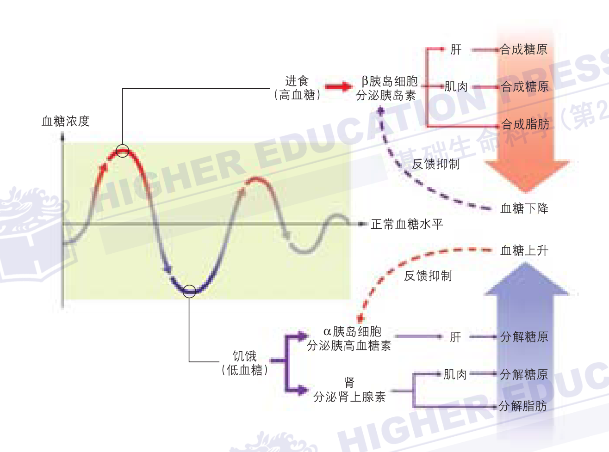

# Pre Wiki

## Concepts Index：

### 机构
- **EMA (European Medicine Administration)**：欧洲药品管理局
- **FDA（Food and Drug Administration）**：美国食品药品监督管理局。

### 激素和药物
- **胰岛素:**  由胰腺分泌的一种激素，能帮助身体利用葡萄糖作为能量。
- **GLP-1 (胰高血糖素样肽-1):**  由肠道分泌的一种激素，能促进胰岛素分泌，抑制食欲。
- **GLP-1 受体激动剂:**  一类模拟 GLP-1 作用的药物，例如 **司美格鲁肽 (Semaglutide)**。
    * **Ozempic:**  司美格鲁肽的一种剂型，用于治疗二型糖尿病。
    * **Wegovy:**  司美格鲁肽的一种剂型，用于治疗肥胖。
- **GIP (葡萄糖依赖性促胰岛素肽):**  由肠道分泌的一种激素，能促进胰岛素分泌。

### 生理学和病理学
- **胰岛素敏感性 (Insulin Sensitivity)**: 身体对胰岛素的反应程度。
- **胰岛素抵抗（Insulin Resistance）**：身体对胰岛素的反应降低，需要更多的胰岛素来控制血糖。
- **糖尿病:** 一种代谢性疾病，特征是血液中的葡萄糖水平过高。
    - **一型糖尿病:**  胰腺不能产生足够的胰岛素。患者通常体型偏瘦。
    - **二型糖尿病:** 身体对胰岛素不敏感，无法有效利用胰岛素。患者通常体型偏胖。
- **代谢性疾病:**  一组影响身体化学过程的疾病，例如糖尿病、肥胖等。

### 其他医学和生物学概念
- **肠促胰素（Incretin）**：一类肠道激素，促进胰岛素分泌。
- **胃肠分泌物（Gastrointestinal Secretions）**：如GIP和GLP，影响胰岛素分泌。
- **肝糖原（Glycogen）**：肝脏储存的糖原。
- **胰腺（Pancreas）**：分泌胰岛素和其他激素的器官。
- **β细胞（Beta Cells）**：胰腺中的细胞，分泌胰岛素。
- **同化激素（Anabolic Hormone）**：促进合成代谢的激素，如胰岛素。
- **异化作用（Catabolic Process）**：分解代谢过程。
- **安慰剂效应:**  接受了没有治疗效果的药物或治疗后，病情却有所好转的现象。

### 实验设计和统计学
- **生活干预（Lifestyle Intervention）**：包括节食和锻炼等行为改变。
- **统计偏差（Statistical Bias）**：实验设计中可能引入的误差。
- **双盲随机对照研究**：一种实验设计，将受试者随机分配到试验组和对照组，受试者和研究人员都不知道谁在接受哪种治疗。

## Concepts

### 概念 1

- **内容**: 内容内容
  - 内容
  - 内容
    > GPT 生成原文
    > 
    > GPT 生成原文

- **参考**: [链接](https://www.example.com)

---

### 血糖浓度调节机制 (课本)

- **内容**: 
  > 
  1. **正常血糖浓度**：
     - 成人血液中葡萄糖的正常质量浓度约为1 mg/mL。
     - 饥饿时，血液中的葡萄糖浓度较低。
     - 饭后，血糖浓度升高。

  2. **胰岛素的作用**：
     - 刚进食后，血糖浓度增加的信号会对胰腺中的β胰岛细胞产生有效刺激，促进其分泌胰岛素（insulin）。
     - 胰岛素能促进肌细胞和肝细胞吸收利用葡萄糖并将其合成为糖原。
     - 胰岛素还能促进脂肪组织利用葡萄糖来制造脂肪。
     - 因此，血糖浓度下降，血糖浓度降低的信号反过来又抑制了胰岛素的分泌。

  3. **饥饿状态下的调节**：
     - 饥饿时，血糖浓度过低的信号会刺激胰腺中的α胰岛细胞分泌胰高血糖素（glucagon），同时刺激肾上腺髓质分泌肾上腺素。
     - 在这两种激素的作用下，肝和肌肉中的糖原被分解为葡萄糖。
     - 另外，肾上腺素还能促进脂肪分解，肝细胞可以利用脂肪分解产生的甘油生成葡萄糖。

  4. **长时间饥饿的调节**：
     - 经过较长时间的饥饿，肾上腺素连续刺激下丘脑产生促肾上腺皮质激素（adrenocorticotropic hormone）释放因子并作用于腺垂体，使腺垂体产生促肾上腺皮质激素。
     - 促肾上腺皮质激素刺激肾上腺皮质分泌氢化可的松。
     - 氢化可的松可以促进肝将蛋白质转化为葡萄糖，以临时补偿血液中的葡萄糖，暂时维持体内的能量供应。

- **参考**: 
    > 血液中葡萄糖浓度水平的稳定对于维持身体各组织
    > 的能量供给十分重要。激素在调节血糖浓度平衡方面是
    > 这样发挥作用的：成人血液中葡萄糖的正常质量浓度在
    > 1 mg/mL 左右，饥饿时血液中的葡萄糖浓度较低，饭后
    > 血糖浓度升高。刚进食后，血糖浓度增加的信号会对胰
    > 腺中的 β 胰岛细胞产生有效刺激，促进其分泌胰岛素
    > （insulin）。胰岛素能促进肌细胞和肝细胞吸收利用葡萄
    > 糖并将其合成为糖原，也能促进脂肪组织利用葡萄糖来
    > 制造脂肪，因此血糖浓度下降，血糖浓度降低的信号反
    > 过来又抑制了胰岛素的分泌。饥饿时，血糖浓度过低的
    > 信号又会刺激胰腺中的α胰岛细胞分泌胰高血糖素
    > （glucagon），同时刺激肾上腺髓质分泌肾上腺素，在这两
    > 种激素的作用下，肝和肌肉中的糖原被分解为葡萄糖。另
    > 外，肾上腺素还能促进脂肪分解，肝细胞可以利用脂肪分
    > 解产生的甘油生成葡萄糖。在上述内分泌腺及激素共同作
    > 用的调节下，人体血糖浓度在正常水平上下波动，相对平
    > 衡，从而保证了体内各组织代谢的能量供应（图 9-41）。
    > 另外，经过较长时间的饥饿，肾上腺素连续刺激下丘脑产
    > 生促肾上腺皮质激素（adrenocorticotropic hormone）释放
    > 因子并作用于腺垂体，使腺垂体产生促肾上腺皮质激素，
    > 后者刺激肾上腺皮质分泌氢化可的松。氢化可的松可以
    > 促进肝将蛋白质转化为葡萄糖，以临时补偿血液中的葡
    > 萄糖，暂时维持体内的能量供应。

### 血糖浓度调节机制 (GLP-GIP)

- 内容：
  1. 胰高血糖素（Glucagon）

    **分泌来源：**
    - 由胰腺的胰岛细胞（α细胞）分泌。

    **作用机制：**
    - 胰高血糖素在夜间及两餐之间分泌，主要作用是维持体内糖和燃料的平衡。
    - 它促使肝脏分解糖原储备，生成葡萄糖和酮体。
    - 还促进脂肪细胞分解脂肪，提供额外的燃料。

    **糖尿病患者的特殊情况：**
    - 糖尿病患者在进餐时，胰高血糖素水平异常升高，导致餐后血糖水平上升。

  2. GLP-1（胰高血糖素样肽1）、GIP（葡萄糖依赖性促胰岛素多肽）和胰岛淀粉样肽（Amylin）

    **分泌来源：**
    - GLP-1和GIP由肠道分泌。
    - 胰岛淀粉样肽与胰岛素一起由胰岛β细胞分泌。

    **作用机制：**
    - GLP-1和GIP是肠促胰岛素分泌激素，促进胰岛β细胞分泌胰岛素，减少α细胞分泌胰高血糖素。
    - GLP-1还减慢胃排空，使大脑感到饱胀和满足。
    - 胰岛淀粉样肽与GLP-1作用相似，减少胰高血糖素水平，降低肝脏的葡萄糖产量，减缓胃排空。

    **糖尿病患者的特殊情况：**
    - 1型糖尿病患者由于β细胞功能不足，导致胰岛素和胰岛淀粉样肽缺失，GLP-1功能异常，进餐时胰高血糖素不受抑制，导致饭后高血糖。

  3. 肾上腺素（Epinephrine）、皮质醇（Cortisol）和生长激素（Growth Hormone）

    **分泌来源：**
    - 肾上腺素由神经末梢和肾上腺分泌。
    - 皮质醇由肾上腺分泌。
    - 生长激素由脑垂体分泌。

    **作用机制：**
    - 这些激素与胰高血糖素一起，被称为“应激”或“葡萄糖反向调节激素”，它们通过不同途径使血糖升高。
    - **肾上腺素：** 促进肝脏糖原分解，生成葡萄糖，并促进脂肪分解，提供糖和酮体。
    - **皮质醇：** 增强肝脏的葡萄糖生产，使脂肪和肌肉细胞对胰岛素产生抵抗。在应激情况下，皮质醇水平升高，导致胰岛素抵抗。
    - **生长激素：** 反向调节胰岛素对肌肉和脂肪细胞的作用，高水平的生长激素导致胰岛素抵抗。

    **糖尿病患者的特殊情况：**
    - 2型糖尿病患者由于胰岛素抵抗，可能需要更多的药物或胰岛素来控制血糖。

### I-Type 糖尿病

- 内容：
  1型糖尿病的发生，是因为**生产胰岛素的细胞数量减少或功能不全**, 这种细胞叫胰岛B细胞。B细胞损伤导致体内胰岛素分泌不足或消失。多数1型糖尿病患者有自身免疫基础，**患者自身的免疫系统错误地攻击并破坏B细胞**。因为胰岛素对维持生命至关重要，所以不足的胰岛素一定要补充。补充胰岛素可以用注射器或胰岛素泵来皮下注射。

- 参考：
  [Diabetes Education Online](https://dtc.ucsf.edu/zh-hans/%e7%b3%96%e5%b0%bf%e7%97%85%e5%88%86%e5%9e%8b/1%e5%9e%8b%e7%b3%96%e5%b0%bf%e7%97%85/%e4%ba%86%e8%a7%a31%e5%9e%8b%e7%b3%96%e5%b0%bf%e7%97%85/%e4%bb%80%e4%b9%88%e6%98%af1%e5%9e%8b%e7%b3%96%e5%b0%bf%e7%97%85/)

### β细胞

- 内容：
  胰岛B细胞也称为胰岛β细胞（英语：Beta cells、β cells），是一类位于胰岛中的细胞，主要功能是分泌可以降低血糖浓度的胰岛素，数量占到胰岛中细胞数量的60-80%。1型糖尿病即由胰岛B细胞功能异常导致

- 参考：
  [胰岛B细胞-Wiki](https://zh.wikipedia.org/zh-sg/%E8%83%B0%E5%B3%B6B%E7%B4%B0%E8%83%9E)

### 异化作用（其实就是代谢）
- 内容：
  异化作用（英语：Catabolism），又称作分解代谢，是生物的新陈代谢途径，将分子分解成更小的单位，并被氧化释放能量的过程，或用于其他合成代谢反应释放能量的过程[1]。 异化作用将大分子（例如多糖、脂类、核酸和蛋白质）分解成更小的单元（例如分别为单糖、脂肪酸、核苷酸和氨基酸）。 

- 参考：
  [异化作用-Wiki](https://zh.wikipedia.org/zh-sg/%E5%BC%82%E5%8C%96%E4%BD%9C%E7%94%A8)

